\# Direct-Booking Vacation Rental Platform

\## Phase 1 Solution Proposal — Single Source of Truth for an 8-Week Multi-Agent Build


\*\*Document version:\*\* 1.0  

\*\*Prepared by:\*\* Solutions Architecture  

\*\*Status:\*\* Approved for execution — no further clarification required


\---


\## Table of Contents


1\. \[Executive Summary](#1-executive-summary)

2\. \[Business Case \& Success Metrics](#2-business-case--success-metrics)

3\. \[Solution Architecture Overview](#3-solution-architecture-overview)

4\. \[Bounded Contexts \& Domain Model](#4-bounded-contexts--domain-model)

5\. \[Database Schema](#5-database-schema)

6\. \[API Design](#6-api-design)

7\. \[Booking State Machine](#7-booking-state-machine)

8\. \[AirBnB iCal Sync Design](#8-airbnb-ical-sync-design)

9\. \[Stripe Payment Flow](#9-stripe-payment-flow)

10\. \[Messaging System Design](#10-messaging-system-design)

11\. \[Reviews, Pricing \& Loyalty Modules](#11-reviews-pricing--loyalty-modules)

12\. \[Admin Dashboard Specification](#12-admin-dashboard-specification)

13\. \[Email Notification Catalog](#13-email-notification-catalog)

14\. \[Identity \& Security Architecture](#14-identity--security-architecture)

15\. \[Azure Infrastructure Topology](#15-azure-infrastructure-topology)

16\. \[CI/CD Pipeline](#16-cicd-pipeline)

17\. \[Observability Plan](#17-observability-plan)

18\. \[Testing Strategy](#18-testing-strategy)

19\. \[8-Week Sprint Plan](#19-8-week-sprint-plan)

20\. \[Parallel Agent Work Breakdown](#20-parallel-agent-work-breakdown)

21\. \[Risk Register](#21-risk-register)

22\. \[Phase 2 Roadmap](#22-phase-2-roadmap)

23\. \[Appendices](#23-appendices)


\---


\## 1. Executive Summary


This proposal defines a Phase 1 direct-booking platform that lets the client capture repeat-guest and word-of-mouth bookings without paying AirBnB's host fee or accepting the guest-side service-fee markup that depresses headline competitiveness. Phase 1 ships in 8 weeks as a web application backed by an API-first, modular-monolith .NET 8 backend running on Azure Container Apps. Native mobile apps, additional OTA channels, and AI-driven pricing are deferred to Phase 2; the architecture admits them without rework.


The single most important engineering constraint — \*\*zero double-bookings between AirBnB and the direct site\*\* — is solved with a defense-in-depth strategy: two-way iCal sync at a 30-minute default poll cadence, plus a mandatory tentative-booking grace window (default 24h, owner-configurable) during which a reconciliation worker re-checks the AirBnB feed and the owner can confirm or reject. A direct booking never reaches `Confirmed` until both the iCal reconciliation and the owner SLA (manual or auto-timeout) clear. Booking holds during checkout are enforced by Redis distributed locks with TTL, eliminating the race-condition class entirely.


Architecturally the system is a \*\*modular monolith\*\* with eleven bounded contexts (Identity, Catalog, Pricing, Booking, Payment, Sync, Messaging, Reviews, Loyalty, Notifications, Admin/Reporting). Internal communication uses MediatR in-process notifications; cross-process communication (workers, email dispatch, sync jobs) uses Azure Service Bus. PostgreSQL 16 on Flexible Server holds all transactional data with per-context schemas. The API is versioned (`/api/v1`), OpenAPI-documented, and stateless behind Container Apps; SignalR Service handles real-time messaging in Serverless mode.


The frontend is \*\*Next.js 14 (App Router) with TypeScript\*\*, chosen over plain React+Vite because public listing pages depend on organic search traffic for the direct-booking funnel — server-rendered metadata and crawlable pages are revenue-critical, not optional. The admin dashboard runs as a separate route segment with client-side rendering.


Execution uses \*\*a monorepo and parallel Claude Code agents\*\* working in git worktrees. The work breakdown defines 9 agents that can run with minimal merge conflict surface once Week 1 establishes shared contracts (DTOs, domain events, OpenAPI spec, ADR baseline). Critical-path dependencies are mapped in Section 20.


\*\*Recommendation summary:\*\*


| Decision | Choice | Rationale |

|---|---|---|

| Frontend | Next.js 14 (App Router) | SEO on listings drives direct-booking traffic |

| Stripe model | Connect \*\*Express\*\* | Platform retains UX \& tax-form control; future multi-tenant ready |

| Email | \*\*SendGrid\*\* (with `INotificationSender` abstraction) | Mature transactional tooling, template editor, deliverability |

| Tax | \*\*Stripe Tax\*\* for supported lodging jurisdictions + manual per-property override table | Best automation available; manual fallback covers gaps |

| SignalR mode | \*\*Serverless\*\* | Container Apps scale-to-zero compatible |

| Repo layout | \*\*Monorepo\*\* | Shared contracts, single CI, easier cross-agent refactors |

| Real-time hub | Azure SignalR Service | Avoids backplane complexity, native scale |


\---


\## 2. Business Case \& Success Metrics


\### 2.1 Business Case


AirBnB's effective take on a booking is the \*\*3% host fee plus a 14–16% guest service fee\*\* that depresses the headline rate the client can show. A direct-booking site lets repeat guests and referrals book at a price that is simultaneously lower for the guest \*and\* higher net for the owner. AirBnB remains the customer-acquisition channel; this platform is the retention and margin-recovery channel.


\### 2.2 Primary KPIs (Phase 1, measured monthly post-launch)


| KPI | Target (M+3) | Target (M+6) | Measurement |

|---|---|---|---|

| Direct booking share of total nights | ≥ 15% | ≥ 30% | `bookings.source = 'direct'` ÷ all booked nights |

| Double-booking incidents | \*\*0\*\* | \*\*0\*\* | Conflict log + manual audit |

| Average Daily Rate (ADR) — direct | +8% vs. AirBnB net | +10% | `revenue ÷ nights\_sold` per channel |

| Occupancy (all channels combined) | ≥ baseline | +3 pts | Booked nights ÷ available nights |

| Repeat-guest rate | ≥ 20% | ≥ 30% | Guests with ≥ 2 completed stays |

| Direct CAC | ≤ $25 | ≤ $20 | Marketing spend ÷ new direct bookers |

| Cart abandonment | ≤ 35% | ≤ 25% | Started checkout but not completed |

| iCal sync success rate | ≥ 99% | ≥ 99.5% | Successful polls ÷ total polls |

| Email deliverability | ≥ 98% | ≥ 98% | SendGrid delivered ÷ sent |


\### 2.3 Operational KPIs


| KPI | Target | Why |

|---|---|---|

| Time from booking → confirmation | ≤ 24h P95, ≤ 1h P50 | Guest confidence |

| Owner SLA breach rate | < 5% | Auto-confirm safety net working |

| Refund processing time | < 7 days | Stripe + policy automation |

| Review submission rate | ≥ 40% of completed stays | Drives ranking + social proof |


\### 2.4 Anti-Goals (explicit non-targets)


\- We are \*\*not\*\* trying to beat AirBnB on first-time-guest discovery. Marketing for Phase 1 is owned-channel (email, social, QR codes in properties, post-stay flyer).

\- We are \*\*not\*\* building a multi-property-owner marketplace in Phase 1. The architecture is multi-tenant-capable but not exposed.


\---


\## 3. Solution Architecture Overview


\### 3.1 C4 Level 1 — System Context


```mermaid

graph TB

&#x20;   Guest(\[Guest])

&#x20;   Owner(\[Owner / Admin])

&#x20;   Anon(\[Anonymous Visitor])


&#x20;   System\[/"Direct-Booking Platform<br/>(Web + API + Workers)"/]


&#x20;   AirBnB\[AirBnB<br/>iCal feed]

&#x20;   Stripe\[Stripe<br/>Payments + Connect]

&#x20;   SendGrid\[SendGrid<br/>Transactional Email]

&#x20;   AADB2C\[Azure AD B2C<br/>Identity]

&#x20;   Maps\[Map Tiles / Geocoding<br/>e.g., MapBox]


&#x20;   Anon -->|browse, search| System

&#x20;   Guest -->|book, pay, message, review| System

&#x20;   Owner -->|manage everything| System


&#x20;   System <-->|two-way iCal sync| AirBnB

&#x20;   System -->|payment intents, refunds, payouts| Stripe

&#x20;   Stripe -->|webhooks| System

&#x20;   System -->|send| SendGrid

&#x20;   System <-->|auth, tokens| AADB2C

&#x20;   System -->|geocode, tiles| Maps

```


\### 3.2 C4 Level 2 — Containers


```mermaid

graph TB

&#x20;   subgraph Browser

&#x20;       WebApp\[Next.js 14 Web App<br/>SSR public + CSR admin]

&#x20;   end


&#x20;   subgraph "Azure Container Apps Environment"

&#x20;       API\[REST API<br/>ASP.NET Core 8<br/>/api/v1]

&#x20;       SyncWorker\[Sync Worker<br/>iCal poll + reconcile<br/>Container App Job - scheduled]

&#x20;       EmailWorker\[Notification Worker<br/>processes Service Bus]

&#x20;       BookingWorker\[Booking Worker<br/>SLA timers, state transitions]

&#x20;       WebhookHandler\[Stripe Webhook Handler<br/>part of API]

&#x20;   end


&#x20;   subgraph "Managed Azure Services"

&#x20;       PG\[(PostgreSQL 16<br/>Flexible Server)]

&#x20;       Redis\[(Azure Cache for Redis<br/>locks + sessions + hot data)]

&#x20;       SB\[Service Bus<br/>topics + queues]

&#x20;       Blob\[Blob Storage<br/>images + attachments]

&#x20;       SR\[SignalR Service<br/>Serverless]

&#x20;       KV\[Key Vault]

&#x20;       AI\[App Insights<br/>+ Log Analytics]

&#x20;       ACR\[Container Registry]

&#x20;   end


&#x20;   AADB2C\[Azure AD B2C]

&#x20;   Stripe\[Stripe]

&#x20;   SendGrid\[SendGrid]

&#x20;   AirBnB\[AirBnB iCal]


&#x20;   WebApp -->|HTTPS + JWT| API

&#x20;   WebApp <-->|WebSocket| SR

&#x20;   SR -.negotiate.-> API


&#x20;   API <--> PG

&#x20;   API <--> Redis

&#x20;   API --> SB

&#x20;   API <--> Blob

&#x20;   API <--> KV

&#x20;   API --> AI

&#x20;   API <-->|OIDC| AADB2C

&#x20;   API -->|payments| Stripe

&#x20;   Stripe -->|webhooks| WebhookHandler


&#x20;   SyncWorker --> PG

&#x20;   SyncWorker <--> AirBnB

&#x20;   SyncWorker --> SB

&#x20;   SyncWorker --> AI


&#x20;   EmailWorker <-- SB

&#x20;   EmailWorker --> SendGrid

&#x20;   EmailWorker --> AI


&#x20;   BookingWorker <-- SB

&#x20;   BookingWorker --> PG

&#x20;   BookingWorker --> SB

&#x20;   BookingWorker --> AI


&#x20;   ACR -.image pulls.-> API

&#x20;   ACR -.image pulls.-> SyncWorker

&#x20;   ACR -.image pulls.-> EmailWorker

&#x20;   ACR -.image pulls.-> BookingWorker

```


\### 3.3 Azure Resource Topology


```mermaid

graph LR

&#x20;   subgraph "Resource Group: rg-vrbook-prod"

&#x20;     subgraph "VNet: vnet-vrbook"

&#x20;       subgraph "Subnet: snet-apps"

&#x20;         CAE\[Container Apps Env<br/>cae-vrbook-prod]

&#x20;       end

&#x20;       subgraph "Subnet: snet-data"

&#x20;         PG\[PostgreSQL Flexible<br/>psql-vrbook-prod]

&#x20;         Redis\[Redis Cache<br/>redis-vrbook-prod]

&#x20;       end

&#x20;     end


&#x20;     KV\[Key Vault<br/>kv-vrbook-prod]

&#x20;     ACR\[Container Registry<br/>crvrbookprod]

&#x20;     SB\[Service Bus Namespace<br/>sb-vrbook-prod]

&#x20;     SR\[SignalR Service<br/>sr-vrbook-prod]

&#x20;     Blob\[Storage Account<br/>stvrbookprod]

&#x20;     AI\[Application Insights<br/>appi-vrbook-prod]

&#x20;     LA\[Log Analytics<br/>law-vrbook-prod]

&#x20;     AADB2C\[AD B2C Tenant<br/>vrbookb2c.onmicrosoft.com]

&#x20;     FD\[Front Door / CDN<br/>fd-vrbook-prod]

&#x20;   end


&#x20;   Internet(\[Internet]) --> FD

&#x20;   FD --> CAE

&#x20;   CAE -.private endpoints.-> PG

&#x20;   CAE -.private endpoints.-> Redis

&#x20;   CAE -.MI.-> KV

&#x20;   CAE -.MI.-> Blob

&#x20;   CAE -.MI.-> SB

&#x20;   CAE -.MI.-> ACR

&#x20;   CAE --> SR

&#x20;   CAE --> AI

&#x20;   AI --> LA

```


\*\*Recommendation:\*\* Use a single VNet with two subnets (apps and data). PostgreSQL and Redis are reached via Private Endpoints; Container Apps Environment is VNet-integrated. Front Door provides global TLS, WAF, and caching for static frontend assets. Managed Identities (MI) authenticate workloads to Key Vault, Blob, Service Bus, and ACR — no connection strings in config.


\### 3.4 Key Architectural Patterns


| Pattern | Where applied |

|---|---|

| Clean Architecture | Solution layering: Domain → Application → Infrastructure → Web |

| CQRS via MediatR | Every API endpoint dispatches a `IRequest<TResponse>`; handlers in Application layer |

| Outbox pattern | Domain events persisted in same transaction, dispatched to Service Bus by worker |

| Strategy pattern | `IExternalChannel` (AirBnB now; VRBO/Booking later); `IPricingRule` (rule engine) |

| Saga / process manager | Booking lifecycle owns the state machine and reacts to Payment, Sync, SLA-timer events |

| Distributed lock | Redis `SET NX PX` for booking holds during checkout |

| Idempotency keys | All Stripe writes + all external webhook handlers + iCal event UIDs |


\---


\## 4. Bounded Contexts \& Domain Model


\### 4.1 Context Map


```mermaid

graph TB

&#x20;   Identity\[Identity]

&#x20;   Catalog\[Catalog]

&#x20;   Pricing\[Pricing]

&#x20;   Booking\[Booking]

&#x20;   Payment\[Payment]

&#x20;   Sync\[Sync]

&#x20;   Messaging\[Messaging]

&#x20;   Reviews\[Reviews]

&#x20;   Loyalty\[Loyalty]

&#x20;   Notifications\[Notifications]

&#x20;   Admin\[Admin / Reporting]


&#x20;   Identity -.user identity.-> Catalog

&#x20;   Identity -.user identity.-> Booking

&#x20;   Identity -.user identity.-> Messaging

&#x20;   Identity -.user identity.-> Reviews


&#x20;   Catalog -->|property data| Booking

&#x20;   Catalog -->|property data| Pricing

&#x20;   Catalog -->|property data| Sync


&#x20;   Pricing -->|quote| Booking

&#x20;   Loyalty -->|tier discount| Pricing

&#x20;   Loyalty -->|tier discount| Booking


&#x20;   Booking -->|booking events| Payment

&#x20;   Booking -->|booking events| Messaging

&#x20;   Booking -->|booking events| Reviews

&#x20;   Booking -->|booking events| Loyalty

&#x20;   Booking -->|booking events| Notifications

&#x20;   Booking <-->|conflict detection| Sync


&#x20;   Payment -.payment events.-> Booking

&#x20;   Sync -.external reservations.-> Booking


&#x20;   Notifications -.emails, push.-> Identity

&#x20;   Admin -.read all.-> Catalog

&#x20;   Admin -.read all.-> Booking

&#x20;   Admin -.read all.-> Payment

&#x20;   Admin -.read all.-> Reviews

```


\### 4.2 Ubiquitous Language Glossary


| Term | Definition |

|---|---|

| \*\*Property\*\* | A bookable physical accommodation owned by the client |

| \*\*Listing\*\* | A property's public-facing presentation (subset of property data + photos + description) |

| \*\*Booking\*\* | A guest's reservation of a property for a date range, with a defined lifecycle |

| \*\*External Reservation\*\* | A booking that originated on AirBnB (or a future channel), known via iCal |

| \*\*Hold\*\* | A 15-minute Redis lock placed on dates during checkout to prevent concurrent grabs |

| \*\*Tentative Window\*\* | The grace period (default 24h) between booking creation and confirmation |

| \*\*Sync Run\*\* | One execution of the iCal poll worker for a single property |

| \*\*Quote\*\* | A calculated price for a property + date range + guest count, valid for N minutes |

| \*\*Stay\*\* | A confirmed booking after check-in (Confirmed → CheckedIn → CheckedOut → Completed) |

| \*\*Loyalty Tier\*\* | Bronze / Silver / Gold classification based on completed stay count |

| \*\*Feature Toggle\*\* | A boolean (per-property or global) governing optional behaviour (reviews, messaging, dynamic pricing) |


\### 4.3 Per-Context Aggregates, Entities, Value Objects, Events


\#### Identity

\- \*\*Aggregate:\*\* `User` (root)

\- \*\*Entities:\*\* `Role`

\- \*\*Value Objects:\*\* `Email`, `PhoneNumber`, `FullName`

\- \*\*Events:\*\* `UserRegistered`, `UserEmailVerified`, `UserDeactivated`

\- \*\*Notes:\*\* AD B2C is the source of truth for credentials; this module maintains app-side profile, claims, roles. We sync via JWT claims + an on-first-login provisioning step.


\#### Catalog

\- \*\*Aggregates:\*\* `Property` (root), `Amenity` (root, lookup)

\- \*\*Entities:\*\* `PropertyImage`, `HouseRule`, `PropertyAmenity`

\- \*\*Value Objects:\*\* `Address` (street, city, state, postal, lat/long), `Capacity` (guests, bedrooms, bathrooms, beds), `CheckInWindow`

\- \*\*Events:\*\* `PropertyCreated`, `PropertyUpdated`, `PropertyImageAdded`, `PropertyDeactivated`


\#### Pricing

\- \*\*Aggregates:\*\* `PricingPlan` (root, per property), `Quote` (root, ephemeral)

\- \*\*Entities:\*\* `PricingRule` (date-range, day-of-week, length-of-stay, last-minute), `Fee` (cleaning, additional-guest, security deposit)

\- \*\*Value Objects:\*\* `Money`, `DateRange`, `RulePriority`

\- \*\*Events:\*\* `PricingPlanUpdated`, `QuoteGenerated` (in-process only, not persisted)


\#### Booking

\- \*\*Aggregate:\*\* `Booking` (root)

\- \*\*Entities:\*\* `BookingGuest` (the primary guest + additional named guests), `CancellationPolicy`, `BookingHold`

\- \*\*Value Objects:\*\* `BookingStatus`, `Stay` (check-in, check-out, nights), `PricingSnapshot` (line items captured at booking time)

\- \*\*Events:\*\* `BookingDraftCreated`, `BookingPlaced` (transitioned to Tentative), `BookingConfirmed`, `BookingRejected`, `BookingCancelled`, `BookingCheckedIn`, `BookingCheckedOut`, `BookingCompleted`, `BookingConflictDetected`

\- \*\*Notes:\*\* The single most important aggregate. The state machine (Section 7) is enforced here.


\#### Payment

\- \*\*Aggregate:\*\* `PaymentIntent` (root, mirrors Stripe), `Refund` (root)

\- \*\*Entities:\*\* `WebhookEvent` (idempotent log)

\- \*\*Value Objects:\*\* `StripeReference`, `Money`, `PaymentStatus`

\- \*\*Events:\*\* `PaymentAuthorized`, `PaymentCaptured`, `PaymentFailed`, `RefundIssued`, `DisputeOpened`


\#### Sync

\- \*\*Aggregates:\*\* `ChannelFeed` (root, per property per channel), `ExternalReservation` (root)

\- \*\*Entities:\*\* `SyncRun`, `SyncConflict`

\- \*\*Value Objects:\*\* `ICalUid`, `ChannelKind` (AirBnB, VRBO, Booking, …), `FeedHealth`

\- \*\*Events:\*\* `ExternalReservationImported`, `ExternalReservationCancelled`, `SyncConflictDetected`, `SyncRunFailed`


\#### Messaging

\- \*\*Aggregate:\*\* `Thread` (root, scoped to a booking)

\- \*\*Entities:\*\* `Message`, `MessageAttachment`

\- \*\*Value Objects:\*\* `MessageBody`, `ReadReceipt`

\- \*\*Events:\*\* `MessageSent`, `MessageRead`


\#### Reviews

\- \*\*Aggregate:\*\* `Review` (root)

\- \*\*Entities:\*\* `ReviewResponse` (owner's reply)

\- \*\*Value Objects:\*\* `Rating` (1–5), `ReviewStatus` (Pending, Approved, Rejected, Hidden)

\- \*\*Events:\*\* `ReviewSubmitted`, `ReviewApproved`, `ReviewResponded`


\#### Loyalty

\- \*\*Aggregate:\*\* `LoyaltyAccount` (root, 1:1 with `User`)

\- \*\*Value Objects:\*\* `Tier` (Bronze, Silver, Gold), `CompletedStayCount`

\- \*\*Events:\*\* `TierPromoted`, `TierDemoted` (reserved; not used in Phase 1)


\#### Notifications

\- \*\*Aggregate:\*\* `NotificationRequest` (root, ephemeral; persisted only for audit)

\- \*\*Value Objects:\*\* `TemplateKey`, `Recipient`, `Channel` (Email, InApp, future: SMS, Push)

\- \*\*Events:\*\* `NotificationDispatched`, `NotificationFailed`


\#### Admin / Reporting

\- \*\*No aggregates\*\* — read-side projections only, populated via domain event handlers into denormalized read tables (`admin.booking\_summary`, `admin.revenue\_daily`, etc.).


\---


\## 5. Database Schema


\### 5.1 Schema Strategy


One PostgreSQL database, \*\*schemas per bounded context\*\* (`identity`, `catalog`, `pricing`, `booking`, `payment`, `sync`, `messaging`, `reviews`, `loyalty`, `notifications`, `admin`). Each context's `DbContext` filters by schema; foreign keys cross schemas only where strictly necessary (e.g., `booking.bookings.guest\_user\_id → identity.users.id`). All tables include the following audit columns unless explicitly waived:


```sql

created\_at        timestamptz NOT NULL DEFAULT now(),

created\_by        uuid        NULL,

updated\_at        timestamptz NOT NULL DEFAULT now(),

updated\_by        uuid        NULL,

row\_version       bigint      NOT NULL DEFAULT 0,   -- optimistic concurrency

deleted\_at        timestamptz NULL,                  -- soft delete (NULL = active)

deleted\_by        uuid        NULL

```


EF Core global query filters exclude `deleted\_at IS NOT NULL` by default. `row\_version` is mapped as the EF concurrency token.


\*\*Migrations:\*\* EF Core migrations run via `dotnet ef database update` invoked from a dedicated `Migrator` console app, which runs as an `initContainer` on each Container App deploy. This avoids the API process needing migrate privileges in production.


\### 5.2 Catalog Schema


```mermaid

erDiagram

&#x20;   properties ||--o{ property\_images : has

&#x20;   properties ||--o{ property\_amenities : has

&#x20;   properties ||--o{ house\_rules : has

&#x20;   amenities ||--o{ property\_amenities : in

&#x20;   properties {

&#x20;       uuid id PK

&#x20;       text title

&#x20;       text slug "unique"

&#x20;       text description

&#x20;       text property\_type "enum"

&#x20;       text street

&#x20;       text city

&#x20;       text state

&#x20;       text postal\_code

&#x20;       text country

&#x20;       numeric latitude

&#x20;       numeric longitude

&#x20;       int max\_guests

&#x20;       int bedrooms

&#x20;       int bathrooms

&#x20;       int beds

&#x20;       time checkin\_from

&#x20;       time checkin\_to

&#x20;       time checkout\_by

&#x20;       boolean is\_active

&#x20;       boolean reviews\_enabled

&#x20;       boolean dynamic\_pricing\_enabled

&#x20;       boolean messaging\_enabled

&#x20;       uuid owner\_user\_id FK

&#x20;   }

&#x20;   property\_images {

&#x20;       uuid id PK

&#x20;       uuid property\_id FK

&#x20;       text blob\_path

&#x20;       text caption

&#x20;       int sort\_order

&#x20;       boolean is\_primary

&#x20;   }

&#x20;   amenities {

&#x20;       uuid id PK

&#x20;       text code "unique"

&#x20;       text name

&#x20;       text icon

&#x20;       text category

&#x20;   }

&#x20;   property\_amenities {

&#x20;       uuid property\_id FK

&#x20;       uuid amenity\_id FK

&#x20;   }

&#x20;   house\_rules {

&#x20;       uuid id PK

&#x20;       uuid property\_id FK

&#x20;       text rule\_text

&#x20;       int sort\_order

&#x20;   }

```


\*\*Indexes:\*\*

\- `properties(slug)` UNIQUE

\- `properties(is\_active, city)` partial index `WHERE deleted\_at IS NULL`

\- `properties USING gist (ll\_to\_earth(latitude, longitude))` for radius search (earthdistance extension)

\- `property\_images(property\_id, sort\_order)`


\### 5.3 Booking Schema


```mermaid

erDiagram

&#x20;   bookings ||--o{ booking\_status\_history : transitions

&#x20;   bookings ||--o{ booking\_line\_items : priced\_with

&#x20;   bookings ||--|| cancellation\_policies : governed\_by

&#x20;   bookings ||--o{ booking\_holds : held\_by

&#x20;   bookings {

&#x20;       uuid id PK

&#x20;       text reference "unique - e.g. VRB-2026-000123"

&#x20;       uuid property\_id FK

&#x20;       uuid guest\_user\_id FK

&#x20;       date checkin\_date

&#x20;       date checkout\_date

&#x20;       int guest\_count

&#x20;       text status "enum"

&#x20;       text source "direct|airbnb|manual"

&#x20;       numeric subtotal

&#x20;       numeric taxes

&#x20;       numeric fees

&#x20;       numeric discount

&#x20;       numeric total

&#x20;       text currency

&#x20;       uuid cancellation\_policy\_id FK

&#x20;       uuid payment\_intent\_id "FK -> payment schema"

&#x20;       timestamptz tentative\_until "SLA deadline"

&#x20;       timestamptz confirmed\_at

&#x20;       timestamptz cancelled\_at

&#x20;       text cancellation\_reason

&#x20;       uuid loyalty\_tier\_at\_booking "snapshot"

&#x20;       numeric loyalty\_discount\_pct "snapshot"

&#x20;   }

&#x20;   booking\_status\_history {

&#x20;       uuid id PK

&#x20;       uuid booking\_id FK

&#x20;       text from\_status

&#x20;       text to\_status

&#x20;       text triggered\_by "user|system|webhook|sla|sync"

&#x20;       text reason

&#x20;       timestamptz at

&#x20;   }

&#x20;   booking\_line\_items {

&#x20;       uuid id PK

&#x20;       uuid booking\_id FK

&#x20;       text label

&#x20;       text kind "nightly|cleaning|extra\_guest|tax|discount|deposit|loyalty"

&#x20;       int quantity

&#x20;       numeric unit\_amount

&#x20;       numeric total

&#x20;   }

&#x20;   cancellation\_policies {

&#x20;       uuid id PK

&#x20;       text code "flexible|moderate|strict"

&#x20;       text description

&#x20;       jsonb rules "\[ {days\_before: 7, refund\_pct: 100}, ... ]"

&#x20;   }

&#x20;   booking\_holds {

&#x20;       uuid id PK

&#x20;       uuid property\_id FK

&#x20;       date checkin\_date

&#x20;       date checkout\_date

&#x20;       uuid session\_id

&#x20;       timestamptz expires\_at

&#x20;   }

```


\*\*Indexes:\*\*

\- `bookings(reference)` UNIQUE

\- `bookings(property\_id, checkin\_date, checkout\_date)` for availability queries

\- `bookings(status, tentative\_until)` for the SLA worker

\- `bookings(guest\_user\_id, status)` for guest profile

\- `booking\_holds(property\_id, expires\_at)` for cleanup

\- `booking\_status\_history(booking\_id, at DESC)`


\*\*Constraint:\*\* A check constraint ensures `checkout\_date > checkin\_date`. Overlap prevention is enforced \*in the booking transaction logic\* (read-modify-write under a Redis hold + a final SQL `SELECT … FOR UPDATE` re-check), not via an exclusion constraint, because we deliberately allow Tentative bookings to coexist briefly with iCal-imported reservations during the conflict-detection window.


\### 5.4 Payment Schema


```mermaid

erDiagram

&#x20;   payment\_intents ||--o{ refunds : refunded\_by

&#x20;   payment\_intents ||--o{ webhook\_events : evented\_by

&#x20;   payment\_intents {

&#x20;       uuid id PK

&#x20;       uuid booking\_id "FK booking.bookings"

&#x20;       text stripe\_payment\_intent\_id "unique"

&#x20;       text stripe\_customer\_id

&#x20;       numeric amount

&#x20;       text currency

&#x20;       text status "enum"

&#x20;       text capture\_method "automatic|manual"

&#x20;       text payment\_method\_id

&#x20;       text idempotency\_key "unique"

&#x20;       jsonb stripe\_metadata

&#x20;   }

&#x20;   refunds {

&#x20;       uuid id PK

&#x20;       uuid payment\_intent\_id FK

&#x20;       text stripe\_refund\_id "unique"

&#x20;       numeric amount

&#x20;       text status

&#x20;       text reason

&#x20;       text initiated\_by

&#x20;   }

&#x20;   webhook\_events {

&#x20;       uuid id PK

&#x20;       text stripe\_event\_id "unique - idempotency"

&#x20;       text event\_type

&#x20;       jsonb payload

&#x20;       timestamptz received\_at

&#x20;       timestamptz processed\_at

&#x20;       text processing\_status "received|processed|failed"

&#x20;       text error

&#x20;   }

```


\### 5.5 Sync Schema


```mermaid

erDiagram

&#x20;   channel\_feeds ||--o{ sync\_runs : produced

&#x20;   channel\_feeds ||--o{ external\_reservations : imported

&#x20;   external\_reservations ||--o{ sync\_conflicts : conflicts\_with

&#x20;   channel\_feeds {

&#x20;       uuid id PK

&#x20;       uuid property\_id "FK catalog.properties"

&#x20;       text channel "airbnb|vrbo|booking|other"

&#x20;       text inbound\_url

&#x20;       text outbound\_token "unique - secret in feed URL"

&#x20;       int poll\_interval\_minutes

&#x20;       boolean is\_enabled

&#x20;       timestamptz last\_success\_at

&#x20;       timestamptz last\_attempt\_at

&#x20;       text last\_error

&#x20;   }

&#x20;   sync\_runs {

&#x20;       uuid id PK

&#x20;       uuid channel\_feed\_id FK

&#x20;       timestamptz started\_at

&#x20;       timestamptz ended\_at

&#x20;       text status "success|failed|partial"

&#x20;       int events\_seen

&#x20;       int events\_new

&#x20;       int events\_updated

&#x20;       int events\_cancelled

&#x20;       text error

&#x20;   }

&#x20;   external\_reservations {

&#x20;       uuid id PK

&#x20;       uuid channel\_feed\_id FK

&#x20;       text ical\_uid "unique per channel\_feed\_id"

&#x20;       date checkin\_date

&#x20;       date checkout\_date

&#x20;       text summary

&#x20;       text raw\_payload

&#x20;       boolean is\_cancelled

&#x20;       timestamptz first\_seen\_at

&#x20;       timestamptz last\_seen\_at

&#x20;   }

&#x20;   sync\_conflicts {

&#x20;       uuid id PK

&#x20;       uuid external\_reservation\_id FK

&#x20;       uuid booking\_id "FK booking.bookings"

&#x20;       text resolution "pending|owner\_kept\_direct|owner\_cancelled\_direct|auto\_cancelled"

&#x20;       text resolution\_notes

&#x20;       timestamptz resolved\_at

&#x20;       uuid resolved\_by

&#x20;   }

```


\*\*Indexes:\*\*

\- `channel\_feeds(property\_id, channel)` UNIQUE

\- `external\_reservations(channel\_feed\_id, ical\_uid)` UNIQUE

\- `external\_reservations(channel\_feed\_id, checkin\_date, checkout\_date) WHERE is\_cancelled = false`

\- `sync\_runs(channel\_feed\_id, started\_at DESC)`


\### 5.6 Pricing Schema


```mermaid

erDiagram

&#x20;   pricing\_plans ||--o{ pricing\_rules : has

&#x20;   pricing\_plans ||--o{ fees : has

&#x20;   pricing\_plans {

&#x20;       uuid id PK

&#x20;       uuid property\_id FK

&#x20;       numeric base\_nightly\_rate

&#x20;       numeric weekend\_rate

&#x20;       text currency

&#x20;       int min\_stay\_nights

&#x20;       int max\_stay\_nights

&#x20;       boolean dynamic\_enabled

&#x20;   }

&#x20;   pricing\_rules {

&#x20;       uuid id PK

&#x20;       uuid pricing\_plan\_id FK

&#x20;       text rule\_kind "date\_range|day\_of\_week|length\_of\_stay|last\_minute"

&#x20;       int priority

&#x20;       date start\_date

&#x20;       date end\_date

&#x20;       int dow\_mask "bitmask Sun..Sat"

&#x20;       int min\_nights

&#x20;       int max\_nights

&#x20;       int days\_before\_checkin

&#x20;       text adjustment\_kind "absolute|multiplier|override"

&#x20;       numeric adjustment\_value

&#x20;       boolean is\_enabled

&#x20;   }

&#x20;   fees {

&#x20;       uuid id PK

&#x20;       uuid pricing\_plan\_id FK

&#x20;       text kind "cleaning|extra\_guest|deposit|tax"

&#x20;       numeric amount

&#x20;       text basis "per\_stay|per\_night|per\_guest|percentage"

&#x20;       int free\_threshold "e.g. extra\_guest charged after N guests"

&#x20;   }

```


\### 5.7 Identity, Messaging, Reviews, Loyalty, Notifications (condensed)


```sql

\-- identity.users

id uuid PK, b2c\_object\_id text UNIQUE, email text UNIQUE,

display\_name text, phone text, is\_owner bool, is\_admin bool,

email\_verified bool, last\_login\_at timestamptz, \[audit]


\-- messaging.threads

id uuid PK, booking\_id uuid FK, guest\_user\_id uuid FK,

owner\_user\_id uuid FK, last\_message\_at timestamptz, \[audit]


\-- messaging.messages

id uuid PK, thread\_id uuid FK, sender\_user\_id uuid FK,

body text, read\_at timestamptz NULL, \[audit]

INDEX (thread\_id, created\_at)


\-- messaging.message\_attachments

id uuid PK, message\_id uuid FK, blob\_path text, content\_type text, size\_bytes int


\-- reviews.reviews

id uuid PK, booking\_id uuid FK UNIQUE, property\_id uuid FK,

guest\_user\_id uuid FK, rating int CHECK (1..5),

body text, status text, published\_at timestamptz, \[audit]


\-- reviews.review\_responses

id uuid PK, review\_id uuid FK UNIQUE, body text, \[audit]


\-- loyalty.loyalty\_accounts

id uuid PK, user\_id uuid FK UNIQUE, tier text,

completed\_stay\_count int, \[audit]


\-- loyalty.tier\_definitions

tier text PK, min\_stays int, max\_stays int NULL,

discount\_pct numeric, is\_enabled bool


\-- notifications.notification\_log

id uuid PK, template\_key text, recipient\_email text,

recipient\_user\_id uuid NULL, channel text, status text,

provider\_message\_id text, error text, sent\_at timestamptz


\-- notifications.feature\_toggles

key text PK, scope text "global|property|user",

scope\_id uuid NULL, enabled bool, \[audit]

```


\### 5.8 Admin / Reporting Schema (read models)


Populated by event handlers; never written to by API request handlers directly.


```sql

\-- admin.revenue\_daily

property\_id uuid, on\_date date, source text,

gross numeric, net numeric, nights int,

PRIMARY KEY (property\_id, on\_date, source)


\-- admin.booking\_funnel

day date, drafts int, tentatives int, confirmed int,

cancelled int, conversion\_pct numeric,

PRIMARY KEY (day)


\-- admin.property\_occupancy

property\_id uuid, on\_date date,

status text "available|booked\_direct|booked\_airbnb|blocked",

PRIMARY KEY (property\_id, on\_date)

```


\---


\## 6. API Design


\### 6.1 Conventions


\- \*\*Base path:\*\* `/api/v1`. Major-version-in-URL, never mixed.

\- \*\*Auth:\*\* Bearer JWT from AD B2C (`Authorization: Bearer <token>`). Anonymous endpoints explicitly marked.

\- \*\*Content-Type:\*\* `application/json; charset=utf-8`. Multipart for file uploads.

\- \*\*Errors:\*\* RFC 7807 Problem Details (`type`, `title`, `status`, `detail`, `traceId`, `errors`). Validation failures return `400` with `errors` keyed by field.

\- \*\*Pagination:\*\* Cursor-based (`?cursor=…\&limit=20`) for high-cardinality lists; offset (`?page=1\&size=20`) for admin tables.

\- \*\*Filtering:\*\* Documented per-endpoint query params. No generic OData/RSQL.

\- \*\*Sorting:\*\* `?sort=field` or `?sort=-field` (descending).

\- \*\*Idempotency:\*\* Mutating endpoints accept `Idempotency-Key` header; we store the hash for 24h and replay the prior response on retry.

\- \*\*Rate limits:\*\* 100 req/min anonymous, 600 req/min authenticated, returned via `RateLimit-\*` headers.


\### 6.2 Endpoint Inventory (selected; full OpenAPI in `/contracts/openapi.yaml`)


\#### Catalog

| Method | Path | Auth | Purpose |

|---|---|---|---|

| GET | `/properties` | Anon | Public search; query: `destination`, `checkin`, `checkout`, `guests`, `min\_price`, `max\_price`, `amenities\[]`, `min\_rating`, `sort`, `cursor`, `limit` |

| GET | `/properties/{slug}` | Anon | Public detail by slug |

| GET | `/properties/{id}/availability?from=\&to=` | Anon | Day-by-day availability |

| POST | `/properties` | Owner | Create |

| PUT | `/properties/{id}` | Owner | Update |

| POST | `/properties/{id}/images` | Owner | Upload (multipart) |

| PUT | `/properties/{id}/images/order` | Owner | Reorder |

| DELETE | `/properties/{id}/images/{imageId}` | Owner | Remove |

| GET | `/amenities` | Anon | Lookup list |


\#### Pricing

| Method | Path | Auth | Purpose |

|---|---|---|---|

| GET | `/properties/{id}/pricing` | Owner | Read pricing plan |

| PUT | `/properties/{id}/pricing` | Owner | Replace plan |

| POST | `/properties/{id}/pricing/rules` | Owner | Add rule |

| DELETE | `/properties/{id}/pricing/rules/{ruleId}` | Owner | Remove rule |

| POST | `/properties/{id}/quotes` | Anon (rate-limited) | Compute price for a date range |


\#### Booking

| Method | Path | Auth | Purpose |

|---|---|---|---|

| POST | `/bookings/holds` | Guest | Create 15-min hold (idempotent) |

| DELETE | `/bookings/holds/{id}` | Guest | Release hold |

| POST | `/bookings` | Guest | Place booking (creates Draft → Tentative on success) |

| GET | `/bookings/{id}` | Guest/Owner | Detail |

| GET | `/bookings` | Guest | My bookings |

| POST | `/bookings/{id}/cancel` | Guest | Cancel (computes refund) |

| POST | `/bookings/{id}/confirm` | Owner | Manual confirm |

| POST | `/bookings/{id}/reject` | Owner | Reject |

| POST | `/bookings/{id}/check-in` | Owner | Mark CheckedIn |

| POST | `/bookings/{id}/check-out` | Owner | Mark CheckedOut |

| GET | `/admin/bookings/queue` | Owner | Pending tentative queue |

| POST | `/admin/bookings/manual` | Owner | Walk-in / phone booking |


\#### Payment

| Method | Path | Auth | Purpose |

|---|---|---|---|

| POST | `/payments/intents` | Guest | Create Stripe Payment Intent for a booking |

| POST | `/payments/intents/{id}/confirm` | Guest | Server-side confirm (when needed) |

| GET | `/payments/intents/{id}` | Guest/Owner | Status |

| POST | `/payments/webhooks/stripe` | Anon (signature-verified) | Stripe webhook |

| POST | `/payments/refunds` | Owner | Issue refund |


\#### Sync

| Method | Path | Auth | Purpose |

|---|---|---|---|

| GET | `/feeds/{outboundToken}.ics` | Anon (token-secured) | Public outbound iCal feed |

| GET | `/admin/channel-feeds` | Owner | List configured feeds |

| POST | `/admin/channel-feeds` | Owner | Configure inbound URL for a property |

| PUT | `/admin/channel-feeds/{id}` | Owner | Update (poll interval, enable/disable) |

| POST | `/admin/channel-feeds/{id}/sync-now` | Owner | Trigger immediate sync |

| GET | `/admin/sync-conflicts` | Owner | List unresolved conflicts |

| POST | `/admin/sync-conflicts/{id}/resolve` | Owner | Resolve a conflict |


\#### Messaging

| Method | Path | Auth | Purpose |

|---|---|---|---|

| GET | `/threads` | Guest/Owner | My threads |

| GET | `/threads/{id}/messages?cursor=` | Guest/Owner | History (cursor pagination) |

| POST | `/threads/{id}/messages` | Guest/Owner | Send |

| POST | `/threads/{id}/read` | Guest/Owner | Mark up-to-now read |

| POST | `/threads/{id}/attachments` | Guest/Owner | Upload (multipart) |

| GET | `/realtime/negotiate` | Guest/Owner | SignalR negotiate handshake |


\#### Reviews

| Method | Path | Auth | Purpose |

|---|---|---|---|

| POST | `/bookings/{id}/review` | Guest | Submit (only after CheckedOut) |

| POST | `/reviews/{id}/response` | Owner | Reply |

| GET | `/properties/{id}/reviews` | Anon | Public list |

| GET | `/admin/reviews/moderation` | Owner | Pending queue |

| POST | `/admin/reviews/{id}/approve` | Owner | Approve |

| POST | `/admin/reviews/{id}/reject` | Owner | Reject |


\#### Identity / Loyalty / Admin

| Method | Path | Auth | Purpose |

|---|---|---|---|

| GET | `/me` | Auth | Profile + tier + saved methods |

| PUT | `/me` | Auth | Update profile |

| DELETE | `/me` | Auth | Self-deactivate (GDPR-ready) |

| GET | `/admin/users` | Owner | Search guests |

| GET | `/admin/reports/occupancy` | Owner | Occupancy report |

| GET | `/admin/reports/revenue` | Owner | Revenue report |

| GET | `/admin/reports/adr` | Owner | ADR report |

| GET | `/admin/toggles` | Owner | Feature toggle inventory |

| PUT | `/admin/toggles/{key}` | Owner | Update toggle |


\### 6.3 Example DTO — POST /bookings


```jsonc

// Request

{

&#x20; "propertyId": "0d1a…",

&#x20; "holdId": "h\_8b…",                    // from POST /bookings/holds

&#x20; "checkinDate": "2026-07-12",

&#x20; "checkoutDate": "2026-07-19",

&#x20; "guestCount": 4,

&#x20; "guests": \[

&#x20;   { "fullName": "Aliya Patel", "isPrimary": true },

&#x20;   { "fullName": "Riya Patel" }

&#x20; ],

&#x20; "specialRequests": "Late check-in around 9pm",

&#x20; "agreedToHouseRules": true,

&#x20; "applyLoyaltyDiscount": true

}


// Response 201

{

&#x20; "id": "b\_4f…",

&#x20; "reference": "VRB-2026-000123",

&#x20; "status": "Tentative",

&#x20; "tentativeUntil": "2026-04-12T18:30:00Z",

&#x20; "totals": {

&#x20;   "subtotal": 1820.00,

&#x20;   "fees": 145.00,

&#x20;   "taxes": 168.00,

&#x20;   "discount": 96.65,

&#x20;   "total": 2036.35,

&#x20;   "currency": "USD"

&#x20; },

&#x20; "lineItems": \[ /\* … \*/ ],

&#x20; "paymentIntent": {

&#x20;   "clientSecret": "pi\_3O…\_secret\_…",

&#x20;   "publishableKey": "pk\_live\_…"

&#x20; }

}

```


\### 6.4 Versioning Strategy


\- URL versioning (`/api/v1`, `/api/v2`).

\- Within a major version, additive only — never break field semantics. New fields are optional; new endpoints are free.

\- Deprecation: mark in OpenAPI (`deprecated: true`), `Sunset` header on responses, minimum 90-day overlap before a `v2` is required for new clients. Phase 1 ships `v1` only.


\---


\## 7. Booking State Machine


\### 7.1 States and Transitions

```mermaid

stateDiagram-v2

&#x20;   \[\*] --> Draft : POST /bookings (initial validation passes)

&#x20;   Draft --> Tentative : payment authorized + hold consumed

&#x20;   Draft --> Cancelled : guest abandons / hold expires

&#x20;   Tentative --> Confirmed : owner confirms OR SLA elapsed AND no iCal conflict

&#x20;   Tentative --> Rejected : owner rejects OR iCal conflict detected and not overridden

&#x20;   Tentative --> Cancelled : guest cancels within tentative window

&#x20;   Confirmed --> CheckedIn : owner marks check-in OR system on check-in date

&#x20;   Confirmed --> Cancelled : guest cancels (policy-driven refund)

&#x20;   CheckedIn --> CheckedOut : owner marks check-out OR system on check-out date

&#x20;   CheckedOut --> Completed : T+24h post-checkout, no dispute opened

&#x20;   CheckedOut --> Disputed : Stripe dispute webhook received

&#x20;   Completed --> Refunded : owner issues post-stay refund (rare)

&#x20;   Confirmed --> Disputed : Stripe dispute webhook received

&#x20;   Disputed --> Refunded : refund issued as resolution

&#x20;   Disputed --> Completed : dispute lost-favor-merchant or guest withdrawn

&#x20;   Rejected --> \[\*]

&#x20;   Cancelled --> \[\*]

&#x20;   Refunded --> \[\*]

&#x20;   Completed --> \[\*]

```





\### 7.2 Transition Table


| From | To | Trigger | Guard | Side Effects |

|---|---|---|---|---|

| Draft | Tentative | `BookingPlace` cmd after PI auth | Hold valid, dates still available, no iCal overlap \*known\* | `BookingPlaced` event → emails to guest + owner; schedule SLA timer |

| Tentative | Confirmed | Owner confirm OR SLA worker | iCal re-check passes; no new conflicts | `BookingConfirmed` → capture Stripe (if auth-only); thread created; confirmation emails |

| Tentative | Rejected | Owner reject | — | `BookingRejected` → void/refund PI; rejection email |

| Tentative | Cancelled | Guest cancel | Within tentative window | `BookingCancelled` → refund (typically 100% in tentative); email |

| Confirmed | CheckedIn | Owner check-in OR scheduler on date | `now >= checkin\_date` | `BookingCheckedIn` → unlock messaging templates |

| Confirmed | Cancelled | Guest cancel | Cancellation policy applied | `BookingCancelled` → policy-driven refund; emails |

| CheckedIn | CheckedOut | Owner check-out OR scheduler on date | `now >= checkout\_date` | `BookingCheckedOut` → review-request scheduler |

| CheckedOut | Completed | Scheduler T+24h | No dispute, no open refund | `BookingCompleted` → loyalty tier reevaluation |

| any | Disputed | Stripe dispute webhook | — | `BookingDisputed` → owner alert |

| Disputed | Refunded | Owner issues refund | — | `RefundIssued` |

| Confirmed/Tentative | Rejected | Sync conflict resolver | Owner chose external | `BookingRejected` + refund |


\### 7.3 Concurrency \& Lock Strategy


\*\*The classic double-book race:\*\* Two guests submit a booking for the same property+dates at the same instant. The system must accept at most one.


The defense, in order:


1\. \*\*Redis hold during checkout.\*\*

&#x20;  When the guest selects dates and proceeds to checkout, `POST /bookings/holds` issues a 15-minute lock via `SET vrbook:hold:{propertyId}:{checkin}:{checkout} NX PX 900000`. Concurrent attempts get `409 Conflict`.


2\. \*\*Idempotency key on `POST /bookings`.\*\*

&#x20;  Re-submits with the same key replay the prior response.


3\. \*\*Database overlap re-check inside a transaction with `SELECT … FOR UPDATE`\*\* on `bookings` rows for the property. Pseudo-SQL:

&#x20;  ```sql

&#x20;  BEGIN;

&#x20;  SELECT 1 FROM booking.bookings

&#x20;   WHERE property\_id = $1

&#x20;     AND status NOT IN ('Cancelled','Rejected','Refunded')

&#x20;     AND deleted\_at IS NULL

&#x20;     AND tstzrange(checkin\_date::timestamptz, checkout\_date::timestamptz, '\[)')

&#x20;         \&\& tstzrange($2::timestamptz, $3::timestamptz, '\[)')

&#x20;   FOR UPDATE;

&#x20;  -- if any row → 409; else INSERT booking

&#x20;  COMMIT;

&#x20;  ```


4\. \*\*Cross-channel reconciliation\*\* — see Section 8.


The `BookingHold` record is mirrored in PostgreSQL (`booking\_holds` table) so we can clean stale Redis state on restart; Redis is authoritative for liveness.


\---


\## 8. AirBnB iCal Sync Design


\### 8.1 Inbound Poll — Sequence


```mermaid

sequenceDiagram

&#x20;   autonumber

&#x20;   participant Scheduler as Container App Job (cron)

&#x20;   participant Worker as Sync Worker

&#x20;   participant DB as PostgreSQL

&#x20;   participant AirBnB as AirBnB .ics URL

&#x20;   participant SB as Service Bus


&#x20;   Scheduler->>Worker: invoke (every 5 min, fan out per property)

&#x20;   Worker->>DB: SELECT feeds DUE (now >= last\_attempt + interval)

&#x20;   loop per feed

&#x20;       Worker->>AirBnB: GET inbound\_url + If-None-Match

&#x20;       alt 304 Not Modified

&#x20;           Worker->>DB: UPDATE last\_attempt\_at, last\_success\_at

&#x20;       else 200 OK

&#x20;           Worker->>Worker: parse with Ical.Net

&#x20;           Worker->>DB: BEGIN

&#x20;           Worker->>DB: UPSERT external\_reservations by (feed\_id, ical\_uid)

&#x20;           Worker->>DB: mark cancelled where uid no longer present

&#x20;           Worker->>DB: detect overlaps with bookings

&#x20;           Worker->>DB: INSERT sync\_conflicts (status=pending)

&#x20;           Worker->>DB: COMMIT

&#x20;           Worker->>SB: publish SyncConflictDetected (if any)

&#x20;           Worker->>SB: publish ExternalReservationImported (per new)

&#x20;       else 5xx or timeout

&#x20;           Worker->>DB: UPDATE last\_error, increment failure\_count

&#x20;           Worker->>SB: publish SyncRunFailed (if failure\_count >= 3)

&#x20;       end

&#x20;   end

```


\*\*Implementation notes:\*\*


\- The job runs every \*\*5 minutes\*\*, but each feed is polled only if `now - last\_attempt\_at >= poll\_interval\_minutes` (default 30). This keeps the worker cheap and lets per-property overrides work without changing cron.

\- ETag / Last-Modified are honoured to minimise AirBnB pull cost and parsing.

\- iCal parsing uses \*\*Ical.Net\*\*. The `UID` is treated as canonical identity; `DTSTART`/`DTEND` are stored as dates (not times — AirBnB exports floating all-day events).

\- Cancellation: AirBnB omits cancelled events from the feed entirely. We detect by \*absence\*: any external\_reservation with `last\_seen\_at` older than `now - 2 \* poll\_interval` and not previously cancelled is marked `is\_cancelled = true`.

\- Lag tolerance: AirBnB's feed update lag is documented at 1–2 hours. The default 24h tentative window covers this.


\### 8.2 Outbound Feed


```

GET /feeds/{outboundToken}.ics

```


\- `outboundToken` is a high-entropy per-channel-feed secret (URL-only; we never expose property IDs). Stored hashed; constant-time compare.

\- Response: `text/calendar; charset=utf-8` with one `VEVENT` per booking in `Confirmed`, `CheckedIn`, `CheckedOut`, `Completed`. Tentative bookings \*\*are included\*\* with `STATUS:TENTATIVE` so AirBnB blocks the date (defensive blocking — better a false-positive block than a double-book).

\- `UID` format: `booking-{id}@vrbook.example.com` — stable across mutations.

\- `LAST-MODIFIED` per event reflects `bookings.updated\_at` so AirBnB sees changes.

\- Caching: feeds are rebuilt on-write (event-driven) into Redis (`vrbook:feed:{token}`) with a 10-minute TTL; reads serve from Redis. `ETag` is the SHA-256 of the body.


\### 8.3 Conflict Detection Algorithm


When a new `external\_reservation` is imported, we evaluate overlap against all bookings for the same property where:

```

status IN ('Tentative','Confirmed','CheckedIn')

AND deleted\_at IS NULL

AND date\_range overlaps \[ext.checkin, ext.checkout)

```


For each overlap, a `sync\_conflict` row is created (`resolution = 'pending'`), a `SyncConflictDetected` event is published, and the owner receives an email + admin-dashboard notification. The booking is \*\*not\*\* automatically cancelled. Owner resolves via `POST /admin/sync-conflicts/{id}/resolve` with one of:


\- `keep\_direct` — mark the external as duplicate (rare; only if AirBnB cancelled and the feed hasn't caught up); resolution is logged.

\- `cancel\_direct` — booking transitions to `Rejected`, full refund initiated, cancellation email to guest.

\- `manual\_override` — owner is taking it offline (e.g., calling guest to move dates); SLA timer paused.


\### 8.4 IExternalChannel Abstraction


```csharp

public interface IExternalChannel

{

&#x20;   ChannelKind Kind { get; }

&#x20;   Task<IReadOnlyList<ExternalReservationDto>> PullAsync(

&#x20;       ChannelFeedConfig config, CancellationToken ct);

&#x20;   Task<string> RenderOutboundFeedAsync(

&#x20;       Guid propertyId, IReadOnlyList<Booking> bookings, CancellationToken ct);

}


// Phase 1: AirBnBICalChannel : IExternalChannel

// Phase 2: VrboICalChannel, BookingComApiChannel, etc.

```


The worker resolves channels by `ChannelKind` via DI. Adding VRBO means implementing the interface and registering it; the worker, schema, and conflict resolution work unchanged.


\### 8.5 Failure Modes \& Observability


| Failure | Detection | Response |

|---|---|---|

| AirBnB feed 404 / DNS fail | HTTP status, exception | Log; mark feed unhealthy after 3 consecutive; email admin |

| Malformed ICS | Ical.Net parse exception | Log raw bytes (truncated 4KB) to App Insights; alert admin |

| Stale feed (no successful poll > 2× interval) | Background health check | Alert admin; dashboard banner |

| Clock skew | NTP-managed VMs | Use `DateTimeOffset.UtcNow` everywhere |

| Worker crash mid-poll | Container Apps restart | Transaction rollback; idempotent re-run by next poll |


Metrics emitted: `sync.poll.duration\_ms`, `sync.events.imported`, `sync.events.cancelled`, `sync.conflicts.detected`, `sync.feed.health{property\_id, channel}` (0/1).


\---


\## 9. Stripe Payment Flow


\### 9.1 Recommended Connect Model


\*\*Recommendation: Stripe Connect Express.\*\*


| Concern | Standard | Express |

|---|---|---|

| Owner onboarding | Stripe-hosted full dashboard | Stripe-hosted minimal onboarding; platform owns most UX |

| 1099-K tax forms | Stripe handles | Stripe handles |

| Negative balance liability | Connected account | \*\*Platform\*\* (acceptable here — single owner = client itself) |

| Branding | Stripe-branded | Platform-branded |

| Phase-2 multi-owner readiness | Possible but UX-light | \*\*Better\*\* — platform can mediate UX uniformly |


For a single-owner Phase 1 the difference is small, but Express is strictly more aligned with the architecture's multi-tenant-ready posture. We onboard one connected account for the client; future owners can be added without re-platforming.


\### 9.2 Tax Strategy


\*\*Recommendation: Stripe Tax with a per-property override table.\*\*


Stripe Tax has US lodging-tax support that is patchwork by jurisdiction. The booking checkout calls `stripe.tax.calculations.create` with the property address as the customer's lodging address; we apply the returned tax. For jurisdictions Stripe Tax does not cover (we maintain a list), the `fees` table holds per-property manual tax rates that the pricing engine applies as line items. The line items are clearly labelled (`label = "Cuyahoga County Lodging Tax (3%)"`) so the owner's bookkeeping is clean.


We do \*\*not\*\* in Phase 1 attempt to file taxes — only to collect them correctly. The owner's accountant remits.


\### 9.3 Booking → Payment Sequence


```mermaid

sequenceDiagram

&#x20;   autonumber

&#x20;   participant FE as Web (Next.js)

&#x20;   participant API as API

&#x20;   participant Redis

&#x20;   participant DB as PostgreSQL

&#x20;   participant Stripe

&#x20;   participant Worker as Booking Worker


&#x20;   FE->>API: POST /bookings/holds {propertyId, dates, guests}

&#x20;   API->>Redis: SET NX hold key, TTL 15m

&#x20;   Redis-->>API: OK

&#x20;   API-->>FE: { holdId, expiresAt }


&#x20;   FE->>API: POST /bookings {holdId, …}  (Idempotency-Key: ik\_…)

&#x20;   API->>DB: BEGIN; SELECT FOR UPDATE; INSERT booking (status=Draft)

&#x20;   API->>Stripe: payment\_intents.create (amount, customer, idemp key)

&#x20;   Stripe-->>API: { id, client\_secret, status: 'requires\_payment\_method' }

&#x20;   API->>DB: INSERT payment\_intents (status=requires\_payment\_method); COMMIT

&#x20;   API-->>FE: { booking, payment.clientSecret }


&#x20;   FE->>Stripe: Stripe.js confirmCardPayment(clientSecret)

&#x20;   Stripe-->>FE: 'succeeded' (auth+capture for full pay, or auth-only for deposit)

&#x20;   Stripe->>API: webhook payment\_intent.succeeded

&#x20;   API->>DB: UPDATE payment\_intents.status=succeeded

&#x20;   API->>DB: UPDATE bookings.status=Tentative; INSERT booking\_status\_history

&#x20;   API->>Redis: DEL hold key

&#x20;   API->>SB: publish BookingPlaced

&#x20;   SB->>Worker: deliver event

&#x20;   Worker->>Worker: schedule SLA timer

&#x20;   Worker->>SB: publish NotificationRequested (guest + owner emails)

```


\### 9.4 Tentative → Confirmed (Capture)


If `capture\_method = 'manual'` (auth-only at booking, capture at confirm), the booking worker captures on `BookingConfirmed`. Default for Phase 1 is \*\*automatic capture\*\* (charge at booking) because the tentative window is short and refund-on-reject is cleaner than capture-on-confirm operationally.


\*\*Trade-off:\*\* Auto-capture means refunds on rejection cost the client Stripe's non-refundable fee (\~30c + 2.9%). Manual capture avoids this but adds operational complexity and a 7-day auth-hold ceiling. \*\*Recommendation: auto-capture in Phase 1\*\*; revisit after measuring rejection rate.


\### 9.5 Refund Flow


```mermaid

sequenceDiagram

&#x20;   participant Owner

&#x20;   participant API

&#x20;   participant Stripe

&#x20;   participant DB

&#x20;   participant SB


&#x20;   Owner->>API: POST /payments/refunds {bookingId, reason}

&#x20;   API->>DB: load booking + payment\_intent + policy

&#x20;   API->>API: compute refund amount per cancellation policy

&#x20;   API->>Stripe: refunds.create (payment\_intent\_id, amount, idemp key)

&#x20;   Stripe-->>API: { id, status: pending }

&#x20;   API->>DB: INSERT refunds

&#x20;   Stripe->>API: webhook charge.refunded

&#x20;   API->>DB: UPDATE refunds.status=succeeded

&#x20;   API->>DB: UPDATE bookings.status=Cancelled or Refunded

&#x20;   API->>SB: publish RefundIssued

```


\### 9.6 Dispute Handling


Stripe `charge.dispute.created` webhook transitions the booking to `Disputed`. The owner receives an alert and uses the Stripe Dashboard (via Express portal link) to upload evidence. The platform tracks state but does not automate evidence submission in Phase 1.


\### 9.7 Webhook Idempotency


Every webhook is logged in `payment.webhook\_events` keyed by `stripe\_event\_id` (UNIQUE). Re-deliveries skip processing if `processing\_status = 'processed'`. Signatures are verified with `Stripe.WebhookSignatureValidator` using the endpoint secret from Key Vault.


\---


\## 10. Messaging System Design


\### 10.1 Topology


```mermaid

graph LR

&#x20;   GuestApp\[Guest browser]

&#x20;   OwnerApp\[Owner browser]

&#x20;   API\[API + SignalR Hub]

&#x20;   SR\[Azure SignalR Service<br/>Serverless mode]

&#x20;   DB\[(PostgreSQL)]

&#x20;   SB\[Service Bus]

&#x20;   Worker\[Notification Worker]

&#x20;   Email\[SendGrid]


&#x20;   GuestApp <-->|WebSocket| SR

&#x20;   OwnerApp <-->|WebSocket| SR

&#x20;   GuestApp -->|REST POST message| API

&#x20;   OwnerApp -->|REST POST message| API

&#x20;   API --> DB

&#x20;   API --> SR

&#x20;   API --> SB

&#x20;   SB --> Worker

&#x20;   Worker -->|if recipient offline > 10m| Email

```


\*\*Recommendation: SignalR Service in Serverless mode.\*\* Container Apps scale to zero; we don't want a persistent hub holding connections. In Serverless mode, the SignalR Service holds connections and our API calls it to broadcast — we never need to maintain client connections on our app instances.


\### 10.2 Message Flow


1\. Client calls `GET /realtime/negotiate` → returns SignalR connection URL + access token (JWT-scoped to `userId`).

2\. Client opens WebSocket to SignalR Service, joins groups `user:{userId}` and `thread:{threadId}` (group membership controlled by API on join).

3\. Sender calls `POST /threads/{id}/messages`. API:

&#x20;  - Persists `Message` row.

&#x20;  - Calls SignalR REST API to broadcast `MessageReceived` to `thread:{threadId}`.

&#x20;  - Publishes `MessageSent` to Service Bus.

4\. If the recipient has no active connection for > 10 minutes (tracked via heartbeat + last-seen-at), the Notification Worker sends an email fallback.


\### 10.3 Persistence


All messages are persisted in PostgreSQL. SignalR is a delivery channel, not a store. Offline clients fetch via `GET /threads/{id}/messages?cursor=` on reconnect; the cursor is the most recent `created\_at` they've seen. Read receipts use `POST /threads/{id}/read` which sets `read\_at` on all messages up to a given message id and broadcasts `MessagesRead` to the thread.


\### 10.4 Attachments


`POST /threads/{id}/attachments` accepts multipart upload. Files are validated (max 10MB, content-type allowlist for images), stored in Blob Storage under `messages/{threadId}/{attachmentId}`, and referenced from the message. SAS URLs (10-min TTL) are issued for download.


\### 10.5 Moderation


Admin view (`GET /admin/threads`) lists all threads with filters (property, date range, flagged). Admin can view any thread read-only. No deletion in Phase 1 — only `hidden\_at` flag for problem messages.


\---


\## 11. Reviews, Pricing \& Loyalty Modules


\### 11.1 Reviews


\- Triggered: `BookingCheckedOut` schedules a `review\_request` email at T+1 day.

\- One review per booking; enforced by `UNIQUE (booking\_id)` on `reviews`.

\- Submission window: 14 days post-checkout.

\- Moderation modes (per-property toggle): `AutoPublish` (default), `RequireApproval`.

\- Owner response is one-to-one with a review; editable until guest replies.

\- Aggregate rating on property is materialized in `catalog.properties.rating\_avg` + `rating\_count`, updated by the `ReviewApproved` event handler in the Catalog module.

\- Toggle: `reviews\_enabled` per property + `global.reviews\_enabled` in feature toggles.


\### 11.2 Dynamic Pricing — Rule Engine


\*\*Rule kinds\*\* (in priority order, lowest priority number wins):


| Priority | Kind | Description |

|---|---|---|

| 10 | `date\_range\_override` | Hard-set rate for a date range (holiday, peak season) |

| 20 | `last\_minute` | Discount if `days\_before\_checkin <= N` |

| 30 | `length\_of\_stay` | Discount tier (e.g., 7+ nights = 10% off, 28+ = 20%) |

| 40 | `day\_of\_week` | Multiplier per day (weekend +20%) |

| 100 | `base` | The base nightly rate from `pricing\_plans` |


\*\*Algorithm\*\* (`PricingEngine.ComputeQuote`):


```csharp

public Quote Compute(Property p, PricingPlan plan, DateRange range, int guests, UserContext user)

{

&#x20;   var nights = new List<NightlyLine>();

&#x20;   foreach (var date in range.EachNight())

&#x20;   {

&#x20;       // Sort enabled rules ascending by priority

&#x20;       var rules = plan.Rules.Where(r => r.IsEnabled \&\& r.Matches(date, range, user))

&#x20;                             .OrderBy(r => r.Priority);

&#x20;       decimal rate = plan.BaseNightlyRate;

&#x20;       foreach (var rule in rules)

&#x20;       {

&#x20;           rate = rule.Apply(rate, date, range);

&#x20;           if (rule.Kind == RuleKind.DateRangeOverride) break; // hard override wins

&#x20;       }

&#x20;       nights.Add(new NightlyLine(date, rate));

&#x20;   }

&#x20;   var subtotal = nights.Sum(n => n.Amount);

&#x20;   var fees = ComputeFees(plan, range, guests);

&#x20;   var loyaltyDiscount = ComputeLoyaltyDiscount(user, subtotal + fees.Sum());

&#x20;   var taxes = TaxEngine.Compute(p.Address, subtotal + fees.Sum() - loyaltyDiscount);

&#x20;   return new Quote(nights, fees, loyaltyDiscount, taxes, …);

}

```


\*\*Preview tool:\*\* `POST /properties/{id}/quotes` returns the full quote with per-night breakdown so the owner can sanity-check rules visually before saving.


\*\*Toggle:\*\* `pricing\_plans.dynamic\_enabled` per property; if false, only the base rate + fees + taxes apply.


\### 11.3 Loyalty


\*\*Tier definition\*\* (configurable in `loyalty.tier\_definitions`):


| Tier | Min stays | Discount % |

|---|---|---|

| Bronze | 1 | 0% |

| Silver | 3 | 5% |

| Gold | 6 | 10% |


\*\*Evaluation:\*\* On `BookingCompleted`, the Loyalty handler increments `completed\_stay\_count` and recomputes tier. The new tier is reflected on the \*next\* booking — we never retroactively re-price.


\*\*Discount application order\*\* (fixed):

1\. Compute subtotal + fees.

2\. Subtract loyalty discount (% of subtotal+fees pre-tax).

3\. Compute taxes on post-discount amount.


\*\*Snapshot:\*\* The applied tier and discount % are stored on the booking (`loyalty\_tier\_at\_booking`, `loyalty\_discount\_pct`) so historical bookings remain accurate even if tier rules change.


\*\*Toggles:\*\* Global `loyalty\_enabled`; can also be disabled per property.


\### 11.4 Feature Toggle Implementation


`notifications.feature\_toggles` (despite the schema name, it serves the whole platform; rename to `core.feature\_toggles` if a future refactor permits):


```sql

key             text NOT NULL,        -- 'reviews', 'messaging', 'dynamic\_pricing', 'loyalty', etc.

scope           text NOT NULL,        -- 'global' | 'property' | 'user'

scope\_id        uuid NULL,            -- NULL for global

enabled         bool NOT NULL,

PRIMARY KEY (key, scope, COALESCE(scope\_id, '00000000-0000-0000-0000-000000000000'::uuid))

```


Resolution order: user-scoped → property-scoped → global → built-in default. Cached in Redis for 60 seconds per resolution to avoid DB chatter; invalidated on write via Service Bus topic.


\---


\## 12. Admin Dashboard Specification


\### 12.1 Information Architecture


Top-level nav: \*\*Dashboard\*\*, \*\*Properties\*\*, \*\*Calendar\*\*, \*\*Bookings\*\*, \*\*Pricing\*\*, \*\*Guests\*\*, \*\*Messages\*\*, \*\*Reviews\*\*, \*\*Reports\*\*, \*\*Sync\*\*, \*\*Settings\*\*.


\### 12.2 Top 6 Screens (wireframe descriptions)


\*\*1. Dashboard (home)\*\*

Header: today's date, "X tentative bookings need attention" pill.

Cards row: This Month — Occupancy %, ADR, Revenue, # Bookings.

Two columns: Pending Tentative (table with Confirm/Reject inline) | Recent Activity feed (booking events, sync events, messages).

Right rail: Sync Health — list of properties with last-success indicator (green/yellow/red).


\*\*2. Calendar (per property)\*\*

Property selector dropdown. Month/Week toggle. Big grid: each cell is a date; bars span days for each booking. Color-coded: Direct (blue), AirBnB (red), Tentative (striped), Blocked (gray), Conflict (red border). Click a bar → side panel with booking detail and quick actions. "Block dates" button for manual blocks.


\*\*3. Booking Detail\*\*

Header: reference, status pill, guest avatar + name, dates, total. Tabs: Overview | Payments | Messages | Timeline.

Overview: line items, cancellation policy, special requests, house-rules acknowledgement.

Payments: Stripe Payment Intent, charges, refunds; "Issue refund" action.

Messages: embedded thread.

Timeline: full `booking\_status\_history` rendered chronologically.


\*\*4. Pricing Editor\*\*

Property selector. Left panel: pricing plan basics (base rate, weekend, fees, min/max stay, dynamic toggle). Right panel: rules list with priority badges, add/edit/delete; drag to reorder priority. Below: "Preview" date-range picker → renders nightly breakdown table.


\*\*5. Sync Conflict Resolution\*\*

Table of unresolved conflicts. Click → modal with two-column compare: Direct Booking | External Reservation; dates highlighted. Three actions: "Cancel direct (refund guest)", "Mark external as duplicate", "Resolve manually (no state change)". Notes field required.


\*\*6. Reports\*\*

Tabs: Occupancy, Revenue, ADR, Booking Source. Date-range filter, property filter. Each tab: stacked-bar / line chart + tabular view + CSV export. Source report includes a direct-vs-AirBnB pie.


\### 12.3 Cross-screen Patterns


\- All tables: server-side pagination, sortable headers, sticky header.

\- All forms: optimistic UI for low-risk actions, blocking spinner for payments/refunds.

\- All destructive actions: confirmation dialog with typed confirmation for refunds > $500 or cancellations > 1 day to check-in.


\---


\## 13. Email Notification Catalog


| Template Key | Trigger Event | Recipient | Channel | Variables |

|---|---|---|---|---|

| `email.verification` | `UserRegistered` | guest | email | `displayName`, `verifyUrl`, `expiresAt` |

| `password.reset` | password reset request (B2C) | guest | email | `displayName`, `resetUrl`, `expiresAt` |

| `booking.received` | `BookingPlaced` | guest | email | `reference`, `propertyTitle`, `checkin`, `checkout`, `total`, `tentativeUntil`, `bookingUrl` |

| `booking.confirmed` | `BookingConfirmed` | guest | email | `reference`, `propertyTitle`, `checkInInstructionsUrl` |

| `booking.rejected` | `BookingRejected` | guest | email | `reference`, `reason`, `refundAmount`, `refundEta` |

| `booking.cancelled.guest` | `BookingCancelled` (by guest) | guest | email | `reference`, `refundAmount`, `policy` |

| `booking.cancelled.owner\_notice` | `BookingCancelled` (by guest) | owner | email | `reference`, `guestName` |

| `pre\_arrival.t-3` | scheduler T-3 days | guest | email | `propertyTitle`, `checkinDate`, `address`, `parkingInfo` |

| `pre\_arrival.t-1` | scheduler T-1 day | guest | email | `propertyTitle`, `checkinInstructions`, `wifiInfo` |

| `checkin.day` | scheduler T-0 | guest | email | `propertyTitle`, `lockboxCode`, `ownerPhone` |

| `review.request` | scheduler T+1 day after CheckedOut | guest | email | `propertyTitle`, `reviewUrl`, `expiresAt` |

| `owner.tentative\_received` | `BookingPlaced` | owner | email + in-app | `reference`, `guestName`, `dates`, `tentativeUntil`, `adminUrl` |

| `owner.auto\_confirmed` | `BookingConfirmed` via SLA | owner | email + in-app | `reference`, `reason` |

| `owner.cancellation\_alert` | `BookingCancelled` | owner | email + in-app | `reference`, `lostRevenue`, `policyApplied` |

| `owner.dispute\_alert` | `BookingDisputed` | owner | email + in-app | `reference`, `disputeReason`, `evidenceDueBy` |

| `owner.sync\_conflict` | `SyncConflictDetected` | owner | email + in-app | `propertyTitle`, `conflictDates`, `resolveUrl` |

| `admin.sync\_failure` | `SyncRunFailed` (>3 consecutive) | admin | email | `propertyTitle`, `channel`, `error`, `runsFailed` |

| `loyalty.tier\_promotion` | `TierPromoted` | guest | email | `newTier`, `discountPct`, `nextStayUrl` |


\*\*Templating:\*\* Mustache via `Stubble.Core`. Shared layout with header (logo, brand band), body slot, footer (address, unsubscribe). Outlook MSO conditional comments for table-based layout fallback. All templates render with a sample variables file in CI to catch regressions.


\*\*Dispatch:\*\* Service Bus topic `notifications`. Notification Worker consumes, renders, sends via SendGrid. On failure: 3 retries with exponential backoff, then dead-letter; admin alerted via dashboard banner.


\---


\## 14. Identity \& Security Architecture


\### 14.1 AD B2C Policy Design


\- \*\*Tenant:\*\* `vrbookb2c.onmicrosoft.com` (separate from any organizational AAD).

\- \*\*Identity providers:\*\* Local (email/password) + Google. Apple deferred to mobile phase.

\- \*\*User flows / custom policies:\*\*

&#x20; - `SignUpSignIn\_v1` (combined; email verification mandatory).

&#x20; - `PasswordReset\_v1`.

&#x20; - `ProfileEdit\_v1` (minimal — most profile lives in our DB).

\- \*\*Tokens:\*\* Access token (60-min TTL) + refresh token (90-day TTL with rolling renewal). Refresh tokens stored in HttpOnly Secure SameSite=Lax cookie on the web app's domain.

\- \*\*Claims emitted:\*\* `oid` (B2C object id), `email`, `email\_verified`, `name`, `extension\_isOwner`, `extension\_isAdmin`. The `isOwner`/`isAdmin` extensions are managed via the Microsoft Graph from an Admin screen.


\### 14.2 Authorization Model


Two-axis: \*\*role\*\* (`Guest`, `Owner`, `Admin`) + \*\*resource ownership\*\* (the user owns the booking, the user owns the thread, etc.).


\- Role check via `\[Authorize(Roles = "Owner,Admin")]`.

\- Ownership check via FluentValidation rules invoked by MediatR pipeline behaviors that load the aggregate and assert the caller's `oid` matches the resource's owner field.

\- Admin can read all; ownership bypass is logged to an audit trail.


\### 14.3 OWASP Top 10 Checklist


| Risk | Mitigation |

|---|---|

| A01 Broken Access Control | Role + ownership pipeline behavior; integration tests assert 403 cases |

| A02 Cryptographic Failures | TLS 1.2+ only; secrets in Key Vault; no PII in logs (Serilog destructuring filter) |

| A03 Injection | EF Core parameterised; FluentValidation on every command; no raw SQL except curated reports |

| A04 Insecure Design | Threat model documented in `/docs/security/threat-model.md`; review with each major change |

| A05 Security Misconfig | Bicep IaC; no public ports; Container Apps ingress restricted; DB Private Endpoint |

| A06 Vulnerable Components | `dotnet list package --vulnerable` in CI; Dependabot on; npm audit gating |

| A07 Auth Failures | B2C handles auth; lockout policies; MFA available for owners |

| A08 Software \& Data Integrity | Signed container images (ACR content trust); SBOM artifact in CI |

| A09 Logging Failures | Serilog → App Insights; alert rules on auth failures, 5xx spikes |

| A10 SSRF | `IExternalChannel` allowlist; AirBnB feed URL validated against scheme/domain pattern; outbound proxy restrictions |


\### 14.4 Secrets Management


\- Key Vault holds: Stripe secret + webhook secret, SendGrid API key, B2C application client secret, JWT signing keys (for any platform-issued tokens — none in Phase 1, but reserved), Postgres admin password (only the migrator uses), Service Bus shared-access keys (fallback; managed identity preferred), feed outbound token hashing pepper.

\- Container Apps reach Key Vault via Managed Identity + Reference syntax: `secretref:my-secret`.

\- No secrets in app config, environment variables (except references), or repo.


\### 14.5 Audit Logging


Append-only `admin.audit\_log` table written by a pipeline behavior on every command:


```sql

id uuid, occurred\_at timestamptz, actor\_user\_id uuid, actor\_role text,

action text, target\_type text, target\_id uuid, before jsonb, after jsonb,

ip text, user\_agent text

```


PII redaction policy applied before write (email/phone masked unless action is identity-related).


\---


\## 15. Azure Infrastructure Topology


\### 15.1 Per-Resource Details


| Resource | SKU (prod) | Notes |

|---|---|---|

| Container Apps Env | Workload Profile (Consumption + Dedicated D4) | VNet-integrated |

| API Container App | min 1 / max 10 replicas, 1 vCPU / 2 GB | HTTP ingress, external |

| Sync Worker Job | Cron `\*/5 \* \* \* \*`, 0.5 vCPU / 1 GB | Container App Job (scheduled) |

| Booking Worker | min 1 / max 5, 0.5 vCPU / 1 GB | Service Bus-triggered (KEDA) |

| Notification Worker | min 1 / max 5, 0.5 vCPU / 1 GB | Service Bus-triggered |

| PostgreSQL Flexible | GP\_Standard\_D4ds\_v5, 128GB, ZRS | Private Endpoint; HA enabled in prod |

| Redis Cache | Standard C1 (1 GB) | Private Endpoint; non-clustered |

| Service Bus | Standard | Topics: `bookings`, `notifications`, `sync`; Queues: `dlq-\*` |

| SignalR Service | Standard, 1 unit | Serverless mode |

| Storage Account | Standard LRS (Hot) | Containers: `property-images`, `message-attachments`, `feed-cache` |

| Key Vault | Standard | Soft-delete + purge protection |

| App Insights | Workspace-based | Linked to Log Analytics |

| Log Analytics | PerGB2018 | 90-day retention |

| Container Registry | Premium | Geo-replication off (single region Phase 1) |

| Front Door | Standard | WAF Default Rule Set |

| AD B2C | Premium P1 | Required for custom policies + MFA |


\### 15.2 Environment Matrix


| | dev | staging | prod |

|---|---|---|---|

| Region | East US 2 | East US 2 | East US 2 (+ DR plan, no DR build in Phase 1) |

| Postgres HA | Off | Off | Zone-redundant HA |

| Postgres SKU | B\_Standard\_B2s | GP\_Standard\_D2ds\_v5 | GP\_Standard\_D4ds\_v5 |

| Container Apps min replicas | 0 | 1 | 1 |

| Stripe | Test mode | Test mode | Live |

| AD B2C tenant | shared `vrbookb2c-dev` | shared `vrbookb2c-staging` | `vrbookb2c` |

| Front Door | No | Yes | Yes |

| AlertActionGroup | dev-team | dev-team + on-call | on-call (PagerDuty) |

| Cost target (monthly) | < $150 | < $400 | < $1,200 (light) |


\### 15.3 Bicep Module Structure


```

/infra

&#x20; /modules

&#x20;   container-apps-env.bicep

&#x20;   container-app.bicep            # parameterized: name, image, env, scale rules

&#x20;   container-app-job.bicep        # parameterized: name, image, schedule, env

&#x20;   postgres-flexible.bicep

&#x20;   redis.bicep

&#x20;   service-bus.bicep

&#x20;   signalr.bicep

&#x20;   storage.bicep

&#x20;   key-vault.bicep                # + secret seeding from pipeline variables

&#x20;   app-insights.bicep

&#x20;   front-door.bicep

&#x20;   network.bicep                  # VNet + subnets + NSGs + private DNS zones

&#x20;   private-endpoint.bicep

&#x20; /environments

&#x20;   dev.bicepparam

&#x20;   staging.bicepparam

&#x20;   prod.bicepparam

&#x20; main.bicep                        # orchestrator

```


Sample skeleton:


```bicep

// main.bicep

param env string

param location string = 'eastus2'


module net './modules/network.bicep'        = { name: 'net', params: { env: env, location: location } }

module kv  './modules/key-vault.bicep'      = { name: 'kv',  params: { env: env, location: location } }

module pg  './modules/postgres-flexible.bicep' = {

&#x20; name: 'pg'

&#x20; params: {

&#x20;   env: env

&#x20;   location: location

&#x20;   subnetId: net.outputs.dataSubnetId

&#x20;   privateDnsZoneId: net.outputs.pgPrivateDnsZoneId

&#x20;   skuName: env == 'prod' ? 'GP\_Standard\_D4ds\_v5' : 'GP\_Standard\_D2ds\_v5'

&#x20;   haEnabled: env == 'prod'

&#x20; }

}

// … rest of modules

```


\---


\## 16. CI/CD Pipeline


\### 16.1 Branch Strategy


\- `main` → production (protected; PR + 1 review + green checks).

\- `develop` → staging (auto-deploy on merge).

\- Feature branches off `develop`; agents work in worktrees on branches like `feat/booking-state-machine`, `feat/sync-airbnb`.

\- Tags `v\*.\*.\*` on `main` cut a versioned release.


\### 16.2 Pipelines (GitHub Actions)


\*\*`ci.yml`\*\* — runs on every PR and push:

\- Restore + build (.NET 8, Node 20).

\- Lint (`dotnet format`, `eslint`, `prettier --check`).

\- Unit tests (backend `xunit`, frontend `vitest`).

\- Integration tests (PostgreSQL + Redis as services; tests use Testcontainers).

\- OpenAPI diff check against `main` (warn on additions, fail on breaks).

\- Build container images (multi-stage Dockerfiles); SBOM (`syft`); vuln scan (`trivy`); push to ACR with tag `${{ github.sha }}` (only on `develop`/`main`).

\- Frontend build (`next build`) → artifact.


\*\*`cd-staging.yml`\*\* — on merge to `develop`:

\- Pull image tag from CI.

\- Bicep `what-if` then deploy to staging.

\- Run migrations via Container App Job invocation.

\- Deploy new revision of API + workers (`az containerapp update`).

\- Smoke-test suite (\~30 critical-path requests).

\- Promote revision to receive 100% traffic.

\- Post deploy summary to Slack.


\*\*`cd-prod.yml`\*\* — manual approval after staging soak (24h default):

\- Same as staging but against prod.

\- Blue/green via Container Apps revisions: new revision gets 10% traffic for 15 min, monitored for error rate; if green, shift to 100%.

\- Rollback: `az containerapp revision activate` to previous.


\### 16.3 Database Migrations


\- EF Core migrations are generated locally (`dotnet ef migrations add`) and committed.

\- The `Migrator` console app runs as the first step of every deploy:

&#x20; - In CI: against staging DB to verify migrations apply cleanly.

&#x20; - In CD: invoked as a one-shot Container App Job before API revision update.

\- Migrations must be \*\*additive and backwards-compatible\*\* with the running app (expand-then-contract: add columns nullable → deploy app → backfill → make NOT NULL in next release).


\### 16.4 Frontend Deploy


Next.js is deployed as a Container App as well (Node 20 runtime image). Static assets are served via Front Door with caching. ISR/revalidation hits the API directly. Build-time public env vars are injected via Container Apps env section; runtime secrets via Key Vault refs.


\---


\## 17. Observability Plan


\### 17.1 Logging


\- Serilog with `WriteTo.ApplicationInsights`.

\- Structured properties: `userId`, `traceId`, `bookingId`, `propertyId`, `correlationId`.

\- PII filter: `email`, `phone`, `address` redacted at sink level via `IDestructuringPolicy` unless the log scope explicitly opts in (identity ops).

\- Levels: `Information` for handler entry/exit (sampled), `Warning` for retried failures, `Error` for unhandled, `Critical` for booking-state corruption.


\### 17.2 Metrics (App Insights customMetrics)


| Metric | Type | Dimensions |

|---|---|---|

| `booking.placed` | counter | propertyId, source |

| `booking.confirmed.latency\_seconds` | histogram | trigger (manual/sla) |

| `booking.rejected` | counter | reason |

| `booking.conflict.detected` | counter | propertyId |

| `payment.intent.created` | counter | — |

| `payment.intent.succeeded` | counter | — |

| `payment.refund.issued` | counter | reason |

| `sync.poll.duration\_ms` | histogram | propertyId, channel |

| `sync.feed.health` | gauge (0/1) | propertyId, channel |

| `email.sent` | counter | templateKey, status |

| `signalr.message.delivered` | counter | — |

| `search.duration\_ms` | histogram | hasDateFilter |


\### 17.3 Dashboards


Single Azure Workbook with sections: Booking Funnel, Payments, Sync Health, Messaging, Errors, Infrastructure (CPU/mem/RPS per Container App).


\### 17.4 Alert Rules


| Alert | Condition | Severity | Channel |

|---|---|---|---|

| Payment webhook 5xx burst | > 5 in 5 min | Sev2 | on-call |

| Sync feed unhealthy | `last\_success\_at < now - 2h` | Sev3 | email |

| 5xx rate on API | > 1% over 10 min | Sev2 | on-call |

| Booking SLA worker silent | no `BookingConfirmed` via SLA path in 6h | Sev3 | email |

| Postgres CPU | > 80% sustained 10 min | Sev2 | on-call |

| Redis evictions | > 0 in 5 min | Sev3 | email |

| Stripe dispute opened | event received | Sev3 | email + dashboard |

| Conflict detected | event received | Sev3 | dashboard banner + owner email |


\### 17.5 On-Call Playbook Stub


For each Sev2: link to runbook in `/docs/runbooks/`:

\- `payment-webhook-failure.md`

\- `sync-feed-stale.md`

\- `api-5xx-spike.md`

\- `postgres-cpu-high.md`


Each runbook follows: Symptom → First-5-Minutes → Diagnostic queries (KQL) → Likely causes → Remediation steps → Escalation.


\---


\## 18. Testing Strategy


\### 18.1 Test Pyramid Targets


| Layer | Tool | Target coverage / count |

|---|---|---|

| Unit (Domain + Application) | xunit + FluentAssertions + NSubstitute | ≥ 70% line, 80% on Booking/Pricing |

| Integration | xunit + Testcontainers (PG + Redis) + WebApplicationFactory | All critical flows covered |

| Contract | Pact (consumer-driven) for FE ↔ API; Spectral lint on OpenAPI | Lint clean; pact green |

| E2E | Playwright | \~30 scenarios covering happy paths + key failure paths |

| Load | k6 | Booking flow at 50 RPS sustained 5 min, P95 < 1s |

| Security | OWASP ZAP baseline scan in CI | No high-severity findings |


\### 18.2 Critical Integration Flows


1\. End-to-end booking: search → hold → book → Stripe webhook → tentative → owner confirm → confirmed.

2\. SLA auto-confirm: book → time-jump → SLA worker → confirmed.

3\. iCal conflict: external\_reservation imported → conflict detected → owner resolves with `cancel\_direct` → booking rejected + refund.

4\. Cancellation policy refund calculation across all three policies × 4 timing buckets.

5\. Concurrent booking attempt for same dates: only one succeeds, the other returns 409.

6\. Stripe webhook idempotency: same event delivered twice → state mutated once.

7\. Loyalty tier promotion on `BookingCompleted` → next quote shows discount.


\### 18.3 Test Data Strategy


\- Per-suite ephemeral PG via Testcontainers; schema applied from EF migrations; seed via fixtures.

\- AirBnB feed mocked with a stub HTTP server (WireMock.Net) serving canned `.ics` files including edge cases (cancelled events, malformed lines, UTF-8 BOM).

\- Stripe in test mode for E2E; webhooks delivered to a public ngrok-style URL via the `cd-staging` environment.


\### 18.4 What NOT to test in Phase 1


\- B2C custom policy internals (use real B2C in staging E2E).

\- Third-party email rendering across all clients (we use Litmus once at end-of-build, not per-PR).

\- DR / region failover.


\---


\## 19. 8-Week Sprint Plan


| Week | Theme | Key Deliverables | Demo |

|---|---|---|---|

| \*\*1\*\* | Foundations \& contracts | Repo skeleton (monorepo); Clean Architecture solution; CI pipeline green; OpenAPI v0.1 (DTOs + endpoints stubbed); Bicep dev env deployed; B2C dev tenant; ADRs for top 10 decisions | `dotnet test` green; staging API returns `503 Not Implemented` for all endpoints with correct OpenAPI |

| \*\*2\*\* | Identity + Catalog | B2C SignUpSignIn wired; `/me`; Property CRUD; image upload + Blob; Next.js property detail page (SSR) | Owner creates a property in the dashboard; it renders at `/listings/{slug}` |

| \*\*3\*\* | Pricing + Quote + Search | Pricing plan + rules; quote endpoint; search with availability filter; property search results page; map view (MapBox) | Search for dates, see filtered results with computed nightly prices |

| \*\*4\*\* | Booking core + Holds + State machine | Hold endpoint (Redis); booking placement; status history; cancellation policies; SLA timer worker scaffold (no AirBnB sync yet — simulated availability) | Guest books a property end-to-end (mock payment); appears in tentative queue; owner confirms |

| \*\*5\*\* | Stripe end-to-end + Refunds + Webhooks | Payment Intents; Connect Express onboarding; webhooks; refund flow with policy calc; Stripe Tax integration with override table | Real test-mode payment; cancellation triggers refund; webhook updates state |

| \*\*6\*\* | iCal sync (inbound + outbound) + Conflict resolution | Sync Worker job; inbound poll with Ical.Net; outbound feed served and cached; conflict detection + admin resolution UI; `IExternalChannel` abstraction | Add AirBnB feed URL; system detects conflict between AirBnB import and a direct tentative booking |

| \*\*7\*\* | Messaging + Reviews + Loyalty + Notifications | SignalR Serverless wired; threads + messages + attachments; review submission + moderation; loyalty tier engine; SendGrid templates (all 18); email worker | Guest and owner chat live; post-stay review email goes out; loyalty tier shows on profile |

| \*\*8\*\* | Admin polish + Reports + Hardening + Launch | Reports (occupancy, revenue, ADR, source); feature toggles UI; Front Door + WAF; load test; security scan; runbooks; production deploy; DNS cutover | Real customer (the client) books a property on prod, end-to-end |


\### 19.1 Milestone Gates


\- \*\*M1 (end W2):\*\* Identity + Catalog live in staging → "we can list properties."

\- \*\*M2 (end W4):\*\* Booking core working without payment → "we can take fake bookings."

\- \*\*M3 (end W6):\*\* End-to-end real-money booking + sync conflict detection → "we are functionally complete."

\- \*\*M4 (end W8):\*\* Production launch.


\### 19.2 Risk Burn-down


Highest-risk items front-loaded: Bicep + B2C in W1, payment in W5, sync in W6 — never the final week.


\---


\## 20. Parallel Agent Work Breakdown


\### 20.1 Dependency Graph


```mermaid

graph TD

&#x20;   A0\[A0 — Foundation<br/>contracts, repo, CI, infra]

&#x20;   A1\[A1 — Identity \& Auth]

&#x20;   A2\[A2 — Catalog \& Search]

&#x20;   A3\[A3 — Pricing Engine]

&#x20;   A4\[A4 — Booking \& State Machine]

&#x20;   A5\[A5 — Payments \& Stripe]

&#x20;   A6\[A6 — Sync — AirBnB iCal]

&#x20;   A7\[A7 — Messaging \& SignalR]

&#x20;   A8\[A8 — Reviews \& Loyalty]

&#x20;   A9\[A9 — Notifications \& Templates]

&#x20;   F1\[F1 — Frontend Web App]

&#x20;   O1\[O1 — Admin Dashboard UI]


&#x20;   A0 --> A1

&#x20;   A0 --> A2

&#x20;   A0 --> A3

&#x20;   A0 --> A9

&#x20;   A0 --> F1

&#x20;   A1 --> A4

&#x20;   A2 --> A4

&#x20;   A3 --> A4

&#x20;   A4 --> A5

&#x20;   A4 --> A6

&#x20;   A4 --> A7

&#x20;   A4 --> A8

&#x20;   A4 --> O1

&#x20;   A2 --> F1

&#x20;   A3 --> F1

&#x20;   A5 --> F1

&#x20;   A7 --> F1

&#x20;   A8 --> F1

&#x20;   A9 -.consumed.-> A4

&#x20;   A9 -.consumed.-> A5

&#x20;   A9 -.consumed.-> A6

```


\*\*Parallelism analysis:\*\*

\- After A0 (W1): A1, A2, A3, A9, F1 can start in parallel (5 streams).

\- After A4 stub merge mid-W3: A5, A6, A7, A8, O1 can all start (5 streams again).

\- The critical path is A0 → A2 → A4 → A5/A6 → A8 → O1. Anything off the critical path can flex.


\### 20.2 Agent Missions


For each agent: scope, inputs, outputs, dependencies, branch name, and a ready-to-paste prompt.


\---


\#### \*\*Agent A0 — Foundation\*\*


\*\*Scope:\*\* Monorepo bootstrap; Clean Architecture solution layout; shared contracts library; CI; Bicep dev environment; baseline ADRs.


\*\*Inputs:\*\* This proposal (`/docs/proposal.md`).


\*\*Outputs:\*\*

\- `/src/VrBook.Domain`, `/src/VrBook.Application`, `/src/VrBook.Infrastructure`, `/src/VrBook.Api`, `/src/VrBook.Migrator` solutions.

\- `/src/VrBook.Contracts` — DTOs, domain event records, enums (shared via project reference).

\- `/infra/\*\*/\*.bicep` — modules and env params.

\- `/web` — Next.js 14 scaffold with App Router.

\- `.github/workflows/ci.yml`, `cd-staging.yml`, `cd-prod.yml`.

\- `/docs/adr/0001-modular-monolith.md` … `0010-…`.

\- `/contracts/openapi.yaml` (skeleton).

\- Dev environment running in Azure.


\*\*Dependencies:\*\* None. \*\*Must complete before all others.\*\*


\*\*Branch:\*\* `feat/a0-foundation`


\*\*Prompt:\*\*

> You are Agent A0 (Foundation) for the vacation rental platform project. Read `/docs/proposal.md` end-to-end before doing anything. Your mission is to bootstrap the monorepo, solution structure, CI pipelines, Bicep dev environment, Next.js scaffold, and the `/contracts/openapi.yaml` and `/src/VrBook.Contracts` shared library with all DTOs and domain events from Sections 4 and 6 of the proposal. Do NOT implement business logic for any context. Stub controllers returning 501. Produce 10 ADRs covering: modular monolith, monorepo, Stripe Connect Express, SendGrid, SignalR Serverless, Next.js, EF Core migrations strategy, Bicep modules, branch strategy, observability stack. Get `dotnet build`, `dotnet test`, `npm build` green and `cd-staging.yml` deploying to Azure. Stop when the dev environment is reachable and all empty endpoints return 501 with correct OpenAPI shapes. Output: PR description with checklist of acceptance criteria + screenshots/links.


\---


\#### \*\*Agent A1 — Identity \& Auth\*\*


\*\*Scope:\*\* AD B2C provisioning (dev tenant), policies, JWT validation middleware, `/me`, role/claim pipeline, audit logging.


\*\*Inputs:\*\* A0 contracts; Section 14 of proposal.


\*\*Outputs:\*\* `VrBook.Modules.Identity` (Domain + Application + Infrastructure); `identity` schema migrations; pipeline behaviors for auth + audit; integration tests; B2C policies committed as XML if custom (else user-flow JSON exports).


\*\*Dependencies:\*\* A0.


\*\*Branch:\*\* `feat/a1-identity`


\*\*Prompt:\*\*

> You are Agent A1 (Identity \& Auth). Read `/docs/proposal.md` Sections 4 (Identity context), 6.2 (endpoints), 14 (security). Implement the Identity bounded context: User aggregate, roles, on-first-login provisioning from B2C claims, `/me` GET/PUT/DELETE, audit log pipeline behavior, role+ownership authorization pipeline behavior. Configure AD B2C SignUpSignIn\_v1, PasswordReset\_v1, ProfileEdit\_v1 user flows; document them in `/docs/b2c/`. Implement JWT bearer validation against the dev B2C tenant. Write integration tests for 401/403/200 across role combinations. Do NOT touch any other context. Coordinate only via the shared `VrBook.Contracts` library and OpenAPI. Stop when CI is green and a real B2C-issued token can hit `/me`.


\---


\#### \*\*Agent A2 — Catalog \& Search\*\*


\*\*Scope:\*\* Property aggregate, CRUD, image upload pipeline, public search with filters, availability projection, slug generation.


\*\*Inputs:\*\* A0 contracts.


\*\*Outputs:\*\* `VrBook.Modules.Catalog`; `catalog` schema migrations; Blob upload service; image processor (ImageSharp: resize + WebP); search query handlers; integration tests.


\*\*Dependencies:\*\* A0. Can run fully parallel with A1, A3.


\*\*Branch:\*\* `feat/a2-catalog`


\*\*Prompt:\*\*

> You are Agent A2 (Catalog \& Search). Read `/docs/proposal.md` Sections 4 (Catalog), 5.2 (schema), 6.2 (endpoints), Section 11 (review aggregate impact on property). Implement the Catalog bounded context: Property aggregate + CRUD; image upload to Blob with ImageSharp resize + WebP + thumbnail generation; public search with all documented filters and sorts; `availability` endpoint that queries `bookings` table (use a read interface — `IBookingAvailabilityReader` — that A4 will provide; until A4 exists, use a stub returning "always available"). Cache hot search results in Redis with 60-second TTL keyed by query hash. Write integration tests with Testcontainers. Coordinate via contracts only. Stop when CI is green and search returns real results from seeded data.


\---


\#### \*\*Agent A3 — Pricing Engine\*\*


\*\*Scope:\*\* Pricing plan + rules CRUD; `PricingEngine.ComputeQuote`; preview endpoint; tax integration hook (stub until A5).


\*\*Inputs:\*\* A0 contracts; Section 11.2.


\*\*Outputs:\*\* `VrBook.Modules.Pricing`; `pricing` schema migrations; rule engine with all 5 rule kinds; comprehensive unit tests (target 90% on engine logic); integration tests for endpoints.


\*\*Dependencies:\*\* A0. Independent of A1, A2.


\*\*Branch:\*\* `feat/a3-pricing`


\*\*Prompt:\*\*

> You are Agent A3 (Pricing Engine). Read `/docs/proposal.md` Sections 4 (Pricing context), 5.6 (schema), 6.2 (endpoints), 11.2 (rule engine), 11.3 (loyalty interaction). Implement the Pricing bounded context: PricingPlan and PricingRule aggregates; all 5 rule kinds (date\_range\_override, last\_minute, length\_of\_stay, day\_of\_week, base); `PricingEngine.ComputeQuote` with the exact algorithm from Section 11.2; preview endpoint. Define `ITaxCalculator` and `ILoyaltyDiscountResolver` interfaces in `VrBook.Contracts` — provide stub implementations in Infrastructure that return zero (A5 and A8 will replace). Write extensive unit tests covering rule priority resolution including ties, override-wins semantics, and bound conditions. Stop when CI is green and `POST /properties/{id}/quotes` returns correct breakdowns for 10 documented test cases.


\---


\#### \*\*Agent A4 — Booking \& State Machine\*\*


\*\*Scope:\*\* Booking aggregate, state machine, holds (Redis + DB), cancellation policies, SLA timer worker, status history.


\*\*Inputs:\*\* A0 contracts; A2 (Property exists); A3 (Quote available); Sections 7, 5.3.


\*\*Outputs:\*\* `VrBook.Modules.Booking`; `booking` schema migrations; `BookingWorker` Container App job; comprehensive state machine tests; `IBookingAvailabilityReader` real implementation.


\*\*Dependencies:\*\* A0; merges of A2 + A3 contracts (not full implementations — stubs work for early integration).


\*\*Branch:\*\* `feat/a4-booking`


\*\*Prompt:\*\*

> You are Agent A4 (Booking \& State Machine). Read `/docs/proposal.md` Sections 4 (Booking context), 5.3 (schema), 6.2 (endpoints), 7 (state machine — exhaustive). Implement the Booking bounded context: Booking aggregate enforcing the state machine in Section 7.2 with explicit guards; BookingHold (Redis SET NX PX + DB mirror); cancellation policies as data-driven JSON rules; SLA-timer worker as a Service Bus-triggered Container App that scheduled events go through Service Bus delayed messages or a cron-based sweep over `tentative\_until <= now`. Implement payment + sync integration via interfaces (`IPaymentService.AuthorizeAsync`, `IExternalChannelConflictChecker`) — stubs returning success until A5/A6. Provide `IBookingAvailabilityReader` for A2. Write 30+ integration tests covering every state transition and every guard. The double-book concurrency test from Section 18.2 must be in this PR. Stop when CI is green and every transition in Section 7.2 has a passing test.


\---


\#### \*\*Agent A5 — Payments \& Stripe\*\*


\*\*Scope:\*\* Stripe Connect Express onboarding; Payment Intents; webhooks; refunds; Stripe Tax integration; idempotency.


\*\*Inputs:\*\* A4 (Booking events); Section 9.


\*\*Outputs:\*\* `VrBook.Modules.Payment`; `payment` schema migrations; webhook handler endpoint; Stripe Tax adapter implementing `ITaxCalculator`; webhook idempotency table; integration tests using Stripe test mode.


\*\*Dependencies:\*\* A4 (interface shape).


\*\*Branch:\*\* `feat/a5-payments`


\*\*Prompt:\*\*

> You are Agent A5 (Payments \& Stripe). Read `/docs/proposal.md` Sections 4 (Payment), 5.4, 6.2, 9 (full). Implement the Payment bounded context using Stripe.net: PaymentIntent + Refund aggregates; webhook endpoint with signature verification + idempotency log (Section 9.7); `IPaymentService.AuthorizeAsync` implementation that creates the Stripe Payment Intent and returns client\_secret; Stripe Tax adapter implementing the `ITaxCalculator` interface A3 defined; Stripe Connect Express onboarding flow (admin endpoint that returns the account-link URL). Wire dispute, refund, and capture webhooks to publish events that A4's Booking handlers will consume. All Stripe calls use idempotency keys. Use Stripe CLI (`stripe listen --forward-to`) for local webhook testing; document the setup. Integration tests run against Stripe test mode. Stop when CI is green and a booking placed via API results in a successful Stripe test charge end-to-end.


\---


\#### \*\*Agent A6 — Sync (AirBnB iCal)\*\*


\*\*Scope:\*\* `IExternalChannel`; `AirBnBICalChannel`; Sync Worker job; inbound poll + dedup; outbound feed serving; conflict detection + resolution admin endpoints.


\*\*Inputs:\*\* A2 (Property); A4 (Booking + conflict checker interface); Section 8.


\*\*Outputs:\*\* `VrBook.Modules.Sync`; `sync` schema migrations; Sync Worker Container App Job; Ical.Net-based parser; outbound feed endpoint; conflict resolution endpoints + UI hooks for O1.


\*\*Dependencies:\*\* A4 (interface shape — the conflict-checker interface should be designed jointly).


\*\*Branch:\*\* `feat/a6-sync`


\*\*Prompt:\*\*

> You are Agent A6 (Sync — AirBnB iCal). Read `/docs/proposal.md` Sections 4 (Sync), 5.5, 6.2, 8 (full, including failure modes). Implement: `IExternalChannel` interface in Contracts; `AirBnBICalChannel` implementation using Ical.Net 4.x with ETag/If-None-Match support; Sync Worker as a Container App Job triggered every 5 minutes that polls all due channel feeds; idempotent UPSERT of external\_reservations keyed on (channel\_feed\_id, ical\_uid); cancellation detection via absence (last\_seen\_at > 2 \* poll\_interval); outbound `/feeds/{outboundToken}.ics` endpoint with token validation + Redis cache + ETag; conflict detection algorithm from Section 8.3; admin endpoints to configure feeds and resolve conflicts. Integration tests use WireMock.Net to serve canned ICS payloads including malformed, BOM, cancelled, and recurring edge cases. Stop when CI is green and a configured AirBnB feed in dev environment produces external\_reservations and detects overlaps with seeded test bookings.


\---


\#### \*\*Agent A7 — Messaging \& SignalR\*\*


\*\*Scope:\*\* Threads + messages; attachments; SignalR Serverless wiring; offline detection; email fallback handoff.


\*\*Inputs:\*\* A4 (Booking creates threads on confirmation); Section 10.


\*\*Outputs:\*\* `VrBook.Modules.Messaging`; `messaging` schema; `/realtime/negotiate`; thread + message endpoints; SignalR service configuration; integration tests for REST; manual test plan for WebSocket.


\*\*Dependencies:\*\* A4 (Booking → Thread creation event).


\*\*Branch:\*\* `feat/a7-messaging`


\*\*Prompt:\*\*

> You are Agent A7 (Messaging \& SignalR). Read `/docs/proposal.md` Sections 4 (Messaging), 5.7, 6.2, 10 (full). Implement: Thread + Message aggregates; auto-create Thread on `BookingConfirmed` event; REST endpoints for messages, read receipts, attachments; `/realtime/negotiate` returning SignalR access token; Azure SignalR Service in Serverless mode (broadcast via REST API client `Microsoft.Azure.SignalR.Management`); attachment upload to Blob with content-type allowlist + 10MB cap + SAS download URLs; last-seen-at tracking via connection events callback; publish `NotificationRequested` to Service Bus when recipient offline > 10 minutes (the email fallback is A9's job). Integration tests for REST; manual scripted test for SignalR broadcasting verified in staging. Stop when CI is green and two browsers in staging can exchange messages in real time.


\---


\#### \*\*Agent A8 — Reviews \& Loyalty\*\*


\*\*Scope:\*\* Review submission + moderation; loyalty tier evaluation; tier-aware quote discount.


\*\*Inputs:\*\* A4 (BookingCompleted event); A3 (provides interface for discount); Section 11.1, 11.3.


\*\*Outputs:\*\* `VrBook.Modules.Reviews`, `VrBook.Modules.Loyalty`; `reviews` and `loyalty` schemas; `ILoyaltyDiscountResolver` implementation (replaces A3's stub); aggregate rating updater hooked to Catalog via event.


\*\*Dependencies:\*\* A4 events.


\*\*Branch:\*\* `feat/a8-reviews-loyalty`


\*\*Prompt:\*\*

> You are Agent A8 (Reviews \& Loyalty). Read `/docs/proposal.md` Sections 4 (Reviews + Loyalty), 5.7, 6.2, 11.1, 11.3. Implement: Review aggregate with 1–5 rating + body + status; submission window enforcement (14 days post-checkout); per-property moderation toggle (AutoPublish vs RequireApproval); owner response (1:1 with review); LoyaltyAccount aggregate; tier definitions table; promotion handler on `BookingCompleted`; `ILoyaltyDiscountResolver` implementation that returns tier discount % for a user (replaces A3's stub); booking-time tier snapshot. Publish `ReviewApproved` event consumed by Catalog to recompute `rating\_avg`. Both global and per-property toggles for reviews; global toggle for loyalty. Unit + integration tests. Stop when CI is green and a Completed booking → review email is queued (A9 sends it), and a Silver-tier user gets 5% off on their next quote.


\---


\#### \*\*Agent A9 — Notifications \& Templates\*\*


\*\*Scope:\*\* Notification Worker (Service Bus consumer); SendGrid integration; Mustache template engine; all 18 templates with shared layout; notification log.


\*\*Inputs:\*\* A0 (Service Bus topology); Section 13.


\*\*Outputs:\*\* `VrBook.Modules.Notifications`; `notifications` schema; Notification Worker Container App; 18 Mustache templates with brand-styled HTML + MSO conditional comments + plain-text alternates; template variable validation in CI.


\*\*Dependencies:\*\* A0. Can run fully parallel from W1 with stub events.


\*\*Branch:\*\* `feat/a9-notifications`


\*\*Prompt:\*\*

> You are Agent A9 (Notifications \& Templates). Read `/docs/proposal.md` Sections 4 (Notifications), 13 (full catalog), 17 (alerts). Implement: Notification Worker as a Service Bus-triggered Container App consuming the `notifications` topic; SendGrid client wrapped behind `INotificationSender` interface; Stubble (Mustache) template renderer; all 18 templates from the catalog with a shared HTML layout (orange/maroon header band, white card, footer with address + unsubscribe), MSO conditional comments, and plain-text fallbacks; per-template variable schema validated at render time; notification\_log table; retry policy (3x exponential backoff → dead-letter). Add a CI step that renders every template with a sample variables file and verifies no Mustache errors. Stop when CI is green and a manually published `BookingPlaced` event in staging triggers a real email to a test inbox.


\---


\#### \*\*Agent F1 — Frontend Web App\*\*


\*\*Scope:\*\* Next.js 14 public site (search, listing, checkout, account) + admin dashboard route segment.


\*\*Inputs:\*\* OpenAPI spec; design system (Tailwind + shadcn/ui).


\*\*Outputs:\*\* `/web` Next.js app with: home, search, listing detail (SSR), checkout flow with Stripe Elements, guest account (bookings, profile, messages), admin dashboard (Section 12). Generated API client from OpenAPI (via `openapi-typescript-codegen`). E2E tests with Playwright.


\*\*Dependencies:\*\* A0 OpenAPI; can stub against the spec from W1 and integrate incrementally as backend agents merge.


\*\*Branch:\*\* `feat/f1-web`


\*\*Prompt:\*\*

> You are Agent F1 (Frontend Web App). Read `/docs/proposal.md` Sections 3 (architecture), 6 (API conventions + endpoints), 7 (state machine — for booking UI), 9 (Stripe Elements integration), 10 (messaging UX), 12 (admin screens). Build the Next.js 14 App Router web app: home page; search page with filters + map (MapBox); SSR listing detail page with structured data for SEO; checkout flow using Stripe Elements (Payment Element); guest account routes (`/account/bookings`, `/account/profile`, `/account/messages`); admin dashboard routes (`/admin/\*`) with all 11 sections from Section 12, prioritising the 6 detailed screens. Generate the API client from `/contracts/openapi.yaml` on every CI run. Use TanStack Query for data fetching, Tailwind + shadcn/ui for styling. Implement responsive design (mobile-first). Playwright E2E covering the 7 critical scenarios from Section 18.2. Coordinate with backend agents only via the OpenAPI spec — never reach into their code. Stop when the booking happy path works end-to-end in staging.


\---


\#### \*\*Agent O1 — Admin Dashboard Refinements\*\*


\*\*Scope:\*\* Reports, sync conflict resolution UI, feature toggle admin, runbook surfacing.


\*\*Inputs:\*\* F1 (admin shell exists); A4, A5, A6, A8 (data sources).


\*\*Outputs:\*\* Reports screens; conflict resolution modal; toggle CRUD UI; dashboard alerts banner.


\*\*Dependencies:\*\* F1 + backend agents merged.


\*\*Branch:\*\* `feat/o1-admin-polish`


\*\*Prompt:\*\*

> You are Agent O1 (Admin Dashboard Refinements). Read `/docs/proposal.md` Section 12 (admin screens), Section 11.4 (toggles), Section 8.3 (conflict resolution), Section 17 (alerts → UI banners). Implement the reports tabs (occupancy, revenue, ADR, source) with Recharts; sync conflict resolution modal (Section 12.2 screen 5); feature toggle administration UI; an alerts banner that surfaces Sev3 dashboard alerts (stale sync, dispute opened, conflict pending) by polling a `/admin/alerts` endpoint (which you also implement on the backend side — add it to the Admin/Reporting module). Stop when an owner can: see all reports, resolve a conflict, toggle reviews off for a property, and dismiss a dashboard alert.


\---


\### 20.3 Coordination Rules


1\. \*\*Contracts are sacred.\*\* Any change to `VrBook.Contracts` or `/contracts/openapi.yaml` requires a fast Slack ping + a PR labelled `contracts-change`. CI fails if a contracts change merges without bumping `/contracts/CHANGELOG.md`.

2\. \*\*Stubs are the protocol.\*\* When Agent X needs something from Agent Y, X writes the interface in Contracts, ships a stub, opens a tracking issue. Y replaces the stub when ready.

3\. \*\*Schema ownership.\*\* Each agent owns its schema's migrations. Cross-schema FKs are allowed but coordinated via PR review (the lead reviews all cross-schema FKs).

4\. \*\*No silent breaking changes.\*\* Renaming a DTO field is a contracts change.

5\. \*\*Worktree per agent.\*\* `git worktree add ../vrbook-A2 feat/a2-catalog`.


\---


\## 21. Risk Register


| # | Risk | Category | Likelihood | Impact | Mitigation | Owner |

|---|---|---|---|---|---|---|

| R1 | AirBnB feed lag exceeds tentative window → double-book | Technical | M | \*\*Critical\*\* | Default 24h tentative window; defensive blocking via tentative-in-outbound-feed; owner alerting; conflict detection on every poll | Lead |

| R2 | Stripe webhook delivery failures cause inconsistent state | Technical | L | High | Webhook idempotency table; reconciliation worker queries Stripe API for any `Tentative` booking older than 1h with no terminal webhook | A5 |

| R3 | AD B2C custom policy complexity slips W1 timeline | Scope | M | M | Use user flows (not custom policies) in Phase 1; reserve custom policies for Phase 2 | A1 |

| R4 | Concurrent bookings race past Redis hold | Technical | L | \*\*Critical\*\* | DB-level `SELECT FOR UPDATE` + overlap check as the authoritative gate (Section 7.3) | A4 |

| R5 | Stripe Connect Express onboarding UX delays go-live | Third-party | M | M | Owner onboards in W5 while feature work continues; not on critical path | A5 |

| R6 | Email deliverability poor at launch (cold IP) | Third-party | M | M | SendGrid shared IP at first; warm domain reputation by sending verification emails to a seed list pre-launch; SPF/DKIM/DMARC in W1 | A9 |

| R7 | Search relevance is poor at low data volume | Product | H | L | Phase 1 has only one owner's properties (≤ 10); ranking is trivial; full-text + filter combos are enough | A2 |

| R8 | Bicep IaC drift over 8 weeks of frequent infra change | Operational | M | M | `bicep what-if` gate on PR; weekly drift detection cron | A0 |

| R9 | Postgres performance unknown under load | Technical | M | M | Load test in W7 with 5x expected traffic; index review before W8 | Lead |

| R10 | Multiple agents create merge conflicts in `VrBook.Contracts` | Process | H | L | Contracts-change PR labelling, fast review SLA (4h), CHANGELOG required | Lead |

| R11 | Tax calculation gaps in non-Stripe-Tax jurisdictions | Compliance | M | H | Per-property manual override table; owner reviews tax line on each property pre-launch | A5 + Lead |

| R12 | SignalR Service free-tier cost surprise on launch | Cost | L | L | Use Standard tier from W7 with explicit unit cap | A7 |


\---


\## 22. Phase 2 Roadmap


\### 22.1 Native Mobile


\*\*Recommendation: React Native with Expo (managed workflow).\*\*


| Option | Pros | Cons | Verdict |

|---|---|---|---|

| .NET MAUI | Single language with backend; native AOT | Smaller community; messaging/payment SDK gaps; iOS quirks | No |

| \*\*React Native + Expo\*\* | Shared TypeScript with web; large ecosystem; Stripe SDK first-class; OTA updates | Native modules sometimes painful | \*\*Yes\*\* |

| PWA | Cheapest; instant deploy | No push reliability on iOS; weak install metaphor | Use for owner mobile only |


We share the TypeScript API client and types with the existing web app via a workspace package. The API requires no changes — it's already designed for non-browser clients.


\### 22.2 Additional OTA Channels


VRBO supports iCal sync (same pattern as AirBnB → new `IExternalChannel` implementation). Booking.com requires the \*\*Connectivity Partner API\*\* — a real REST integration, deeper than iCal, supports rate push and reservation pull. Estimated 4-week effort for Booking.com once accepted into their connectivity program (3-month application process — start in Phase 1 if Phase 2 timing is critical).


\### 22.3 AI-Driven Dynamic Pricing


Once 12 months of booking data exist: train a model on demand signals (search-to-book conversion at price points, day-of-week, lead-time-to-checkin, local event calendar). Recommendation engine outputs a "suggested rate" per night surfaced in the Pricing UI as an opt-in override. \*\*Important:\*\* the rule engine stays; the model is an \*adviser\*, not a controller.


\### 22.4 Multi-Tenant SaaS


The architecture already isolates owner data via `owner\_user\_id` foreign keys and per-property ownership checks. Phase 2 SaaS-ification needs:

\- Tenant header (`X-Tenant-Id`) or subdomain routing.

\- `tenant\_id` column added to all owner-scoped tables (default to single tenant for legacy data).

\- Per-tenant Stripe Connect accounts (already supported by Express).

\- Onboarding flow (property setup wizard, channel feed configuration, Stripe Express link).

\- Pricing model (per-property monthly fee + per-booking fee).

\- Tenant-aware RLS on Postgres (defense-in-depth on top of app-level checks).


\### 22.5 Other Phase 2 Items


\- Smart-lock integration (August, Schlage Encode, RemoteLock) — automatic check-in code provisioning.

\- Multi-language (Spanish, then French; based on guest country distribution).

\- Guest loyalty program enhancements (referral rewards, tier-specific perks).

\- AI concierge in-app assistant.


\---


\## 23. Appendices


\### 23.1 Glossary


See Section 4.2.


\### 23.2 Library / Framework Versions


| Component | Version | Notes |

|---|---|---|

| .NET | 8.0 (LTS) | |

| ASP.NET Core | 8.0 | |

| EF Core | 8.0.x | |

| MediatR | 12.x | |

| FluentValidation | 11.x | |

| Serilog | 4.x | + Sinks.ApplicationInsights |

| Stripe.net | 47.x | |

| Ical.Net | 4.x | |

| Microsoft.Azure.SignalR.Management | 1.25.x | |

| Azure.Messaging.ServiceBus | 7.x | |

| Azure.Storage.Blobs | 12.x | |

| Azure.Identity | 1.12.x | Managed Identity |

| Azure.Security.KeyVault.Secrets | 4.x | |

| Stubble.Core | 1.10.x | Mustache |

| ImageSharp | 3.x | License: 6Lab — confirm commercial OK |

| Testcontainers | 3.x | |

| Node.js | 20 LTS | |

| Next.js | 14.x | App Router |

| React | 18.x | |

| TypeScript | 5.x | |

| TanStack Query | 5.x | |

| Tailwind CSS | 3.4.x | |

| shadcn/ui | latest | copy-in components |

| Stripe.js | latest pinned per build | |

| Playwright | 1.45.x | |

| Bicep | 0.30.x | |


> \*\*Note on ImageSharp:\*\* Six Labors Split License — verify a paid commercial license is acquired or swap to `Magick.NET` if budget excludes it. \*\*Action item for A0.\*\*


\### 23.3 Environment Variable Inventory


```

\# API (Container App env)

ASPNETCORE\_ENVIRONMENT          = Production

ASPNETCORE\_URLS                 = http://+:8080

ConnectionStrings\_\_Postgres     = (secretref) kv:postgres-cs

ConnectionStrings\_\_Redis        = (secretref) kv:redis-cs

ServiceBus\_\_Connection          = (Managed Identity)

SignalR\_\_ConnectionString       = (secretref) kv:signalr-cs

Stripe\_\_SecretKey               = (secretref) kv:stripe-secret

Stripe\_\_WebhookSecret           = (secretref) kv:stripe-webhook-secret

Stripe\_\_PublishableKey          = pk\_live\_…   (non-secret, public)

SendGrid\_\_ApiKey                = (secretref) kv:sendgrid-key

SendGrid\_\_FromAddress           = bookings@vrbook.example.com

AzureAdB2C\_\_Instance            = https://vrbookb2c.b2clogin.com

AzureAdB2C\_\_Domain              = vrbookb2c.onmicrosoft.com

AzureAdB2C\_\_TenantId            = (guid)

AzureAdB2C\_\_ClientId            = (guid)

AzureAdB2C\_\_SignUpSignInPolicyId= B2C\_1\_SignUpSignIn\_v1

Blob\_\_AccountUrl                = https://stvrbookprod.blob.core.windows.net

Blob\_\_PropertyImagesContainer   = property-images

Blob\_\_MessageAttachmentsContainer = message-attachments

Feed\_\_OutboundTokenPepper       = (secretref) kv:feed-pepper

Sync\_\_DefaultPollIntervalMin    = 30

Sync\_\_StaleAlertHours           = 2

Booking\_\_TentativeSlaHours      = 24

Booking\_\_HoldDurationMinutes    = 15

Loyalty\_\_BronzeThreshold        = 1

Loyalty\_\_SilverThreshold        = 3

Loyalty\_\_GoldThreshold          = 6

ApplicationInsights\_\_ConnectionString = (secretref) kv:appi-cs

Frontend\_\_BaseUrl               = https://www.vrbook.example.com


\# Frontend (build-time, prefixed NEXT\_PUBLIC\_ for client)

NEXT\_PUBLIC\_API\_BASE\_URL        = https://api.vrbook.example.com/api/v1

NEXT\_PUBLIC\_STRIPE\_PUBLISHABLE\_KEY = pk\_live\_…

NEXT\_PUBLIC\_B2C\_AUTHORITY       = https://vrbookb2c.b2clogin.com/vrbookb2c.onmicrosoft.com/B2C\_1\_SignUpSignIn\_v1

NEXT\_PUBLIC\_B2C\_CLIENT\_ID       = (guid)

NEXT\_PUBLIC\_MAPBOX\_TOKEN        = pk.eyJ…

NEXT\_PUBLIC\_SIGNALR\_NEGOTIATE\_URL = https://api.vrbook.example.com/api/v1/realtime/negotiate

```


\### 23.4 Sample MediatR Handler


```csharp

public sealed record PlaceBookingCommand(

&#x20;   Guid PropertyId,

&#x20;   Guid HoldId,

&#x20;   DateOnly Checkin,

&#x20;   DateOnly Checkout,

&#x20;   int GuestCount,

&#x20;   IReadOnlyList<BookingGuestDto> Guests,

&#x20;   string? SpecialRequests,

&#x20;   bool ApplyLoyaltyDiscount,

&#x20;   Guid GuestUserId

) : IRequest<PlaceBookingResult>;


public sealed class PlaceBookingHandler(

&#x20;   IBookingRepository bookings,

&#x20;   IPropertyReader properties,

&#x20;   IPricingEngine pricing,

&#x20;   IPaymentService payments,

&#x20;   IHoldStore holds,

&#x20;   IUnitOfWork uow,

&#x20;   IPublisher events,

&#x20;   ILogger<PlaceBookingHandler> log)

&#x20;   : IRequestHandler<PlaceBookingCommand, PlaceBookingResult>

{

&#x20;   public async Task<PlaceBookingResult> Handle(PlaceBookingCommand cmd, CancellationToken ct)

&#x20;   {

&#x20;       var property = await properties.GetActiveByIdAsync(cmd.PropertyId, ct)

&#x20;           ?? throw new NotFoundException("Property not found");


&#x20;       if (!await holds.TryConsumeAsync(cmd.HoldId, cmd.PropertyId, cmd.Checkin, cmd.Checkout, ct))

&#x20;           throw new ConflictException("Hold expired or invalid");


&#x20;       await using var tx = await uow.BeginTransactionAsync(ct);


&#x20;       // Authoritative overlap check under row lock

&#x20;       if (await bookings.HasOverlapAsync(cmd.PropertyId, cmd.Checkin, cmd.Checkout, ct))

&#x20;           throw new ConflictException("Dates no longer available");


&#x20;       var quote = await pricing.ComputeAsync(property.Id, cmd.Checkin, cmd.Checkout,

&#x20;                                              cmd.GuestCount, cmd.GuestUserId, ct);


&#x20;       var booking = Booking.PlaceDraft(property, cmd.GuestUserId, cmd.Checkin, cmd.Checkout,

&#x20;                                        cmd.GuestCount, cmd.Guests, quote, cmd.SpecialRequests);


&#x20;       await bookings.AddAsync(booking, ct);


&#x20;       var pi = await payments.AuthorizeAsync(booking, ct);

&#x20;       booking.AttachPaymentIntent(pi.Id);


&#x20;       await uow.SaveChangesAsync(ct);

&#x20;       await tx.CommitAsync(ct);


&#x20;       foreach (var e in booking.DequeueEvents())

&#x20;           await events.Publish(e, ct);


&#x20;       log.LogInformation("Booking {Reference} placed in Draft for property {PropertyId}",

&#x20;                          booking.Reference, property.Id);


&#x20;       return new PlaceBookingResult(booking, pi.ClientSecret);

&#x20;   }

}

```


\### 23.5 Sample Bicep — Container App for the API


```bicep

param name string

param location string

param environmentId string

param containerImage string

param registryServer string

param userAssignedIdentityId string

param keyVaultName string

param ingressTargetPort int = 8080

param minReplicas int = 1

param maxReplicas int = 10


resource api 'Microsoft.App/containerApps@2024-03-01' = {

&#x20; name: name

&#x20; location: location

&#x20; identity: {

&#x20;   type: 'UserAssigned'

&#x20;   userAssignedIdentities: { '${userAssignedIdentityId}': {} }

&#x20; }

&#x20; properties: {

&#x20;   environmentId: environmentId

&#x20;   configuration: {

&#x20;     ingress: {

&#x20;       external: true

&#x20;       targetPort: ingressTargetPort

&#x20;       transport: 'auto'

&#x20;       allowInsecure: false

&#x20;     }

&#x20;     registries: \[

&#x20;       {

&#x20;         server: registryServer

&#x20;         identity: userAssignedIdentityId

&#x20;       }

&#x20;     ]

&#x20;     secrets: \[

&#x20;       { name: 'postgres-cs', keyVaultUrl: 'https://${keyVaultName}.vault.azure.net/secrets/postgres-cs', identity: userAssignedIdentityId }

&#x20;       { name: 'redis-cs',    keyVaultUrl: 'https://${keyVaultName}.vault.azure.net/secrets/redis-cs',    identity: userAssignedIdentityId }

&#x20;       { name: 'stripe-secret', keyVaultUrl: 'https://${keyVaultName}.vault.azure.net/secrets/stripe-secret', identity: userAssignedIdentityId }

&#x20;       // … remaining secrets

&#x20;     ]

&#x20;   }

&#x20;   template: {

&#x20;     containers: \[

&#x20;       {

&#x20;         name: 'api'

&#x20;         image: containerImage

&#x20;         resources: { cpu: 1, memory: '2Gi' }

&#x20;         env: \[

&#x20;           { name: 'ASPNETCORE\_ENVIRONMENT', value: 'Production' }

&#x20;           { name: 'ConnectionStrings\_\_Postgres', secretRef: 'postgres-cs' }

&#x20;           { name: 'ConnectionStrings\_\_Redis',    secretRef: 'redis-cs' }

&#x20;           { name: 'Stripe\_\_SecretKey',           secretRef: 'stripe-secret' }

&#x20;           // …

&#x20;         ]

&#x20;         probes: \[

&#x20;           { type: 'Liveness',  httpGet: { path: '/health/live',  port: ingressTargetPort }, periodSeconds: 30 }

&#x20;           { type: 'Readiness', httpGet: { path: '/health/ready', port: ingressTargetPort }, periodSeconds: 10 }

&#x20;         ]

&#x20;       }

&#x20;     ]

&#x20;     scale: {

&#x20;       minReplicas: minReplicas

&#x20;       maxReplicas: maxReplicas

&#x20;       rules: \[

&#x20;         { name: 'http-scale', http: { metadata: { concurrentRequests: '50' } } }

&#x20;       ]

&#x20;     }

&#x20;   }

&#x20; }

}


output fqdn string = api.properties.configuration.ingress.fqdn

```


\### 23.6 References


\- AirBnB iCal documentation (host-facing calendar import/export).

\- Stripe Connect Express docs (Onboarding, Payment Intents, Tax, Webhooks).

\- Azure Container Apps documentation (KEDA scalers, Jobs, revisions).

\- RFC 5545 — iCalendar specification.

\- RFC 7807 — Problem Details for HTTP APIs.

\- Azure Architecture Center — Modular monolith with .NET 8 reference.


\---


\*\*End of proposal — v1.0 — ready for execution.\*\*

